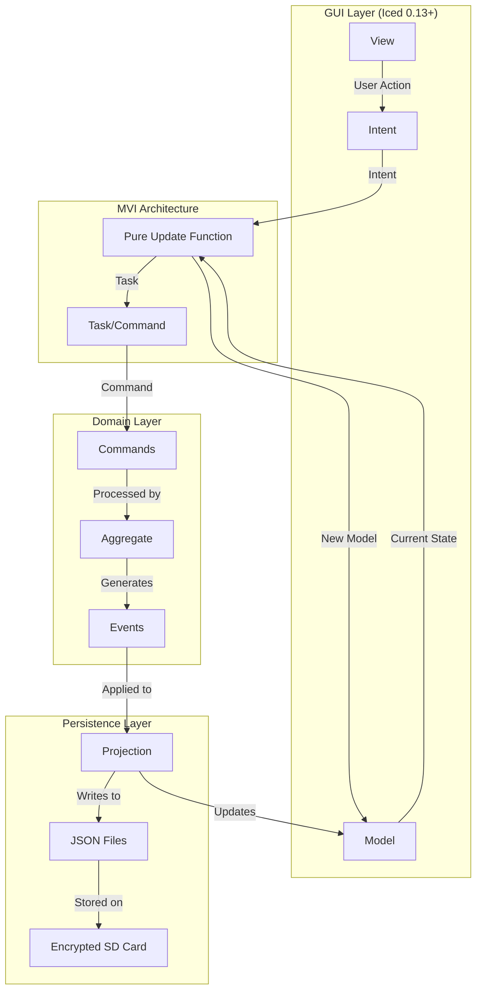
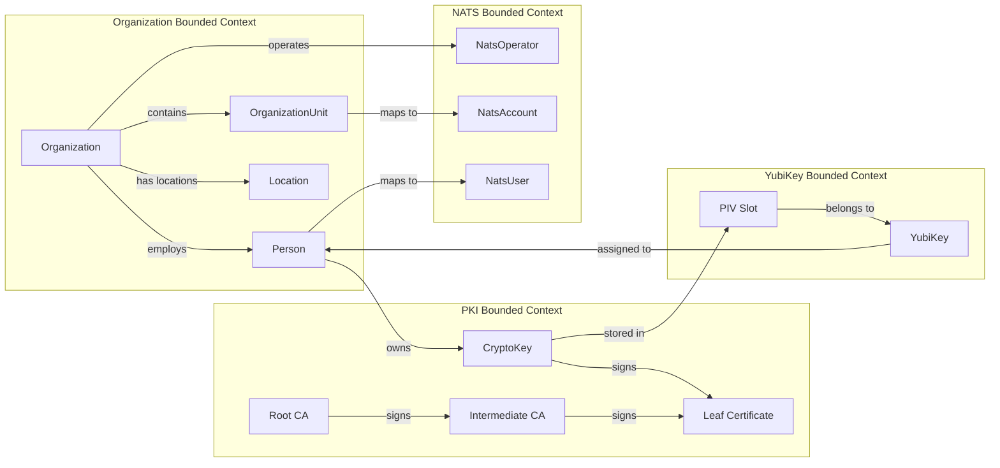
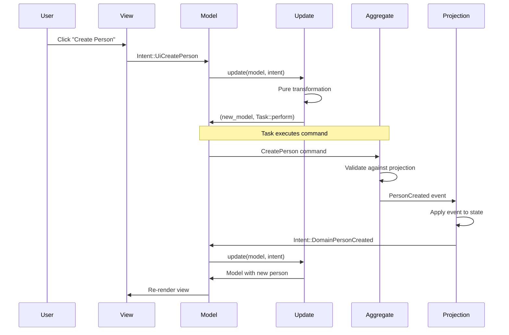
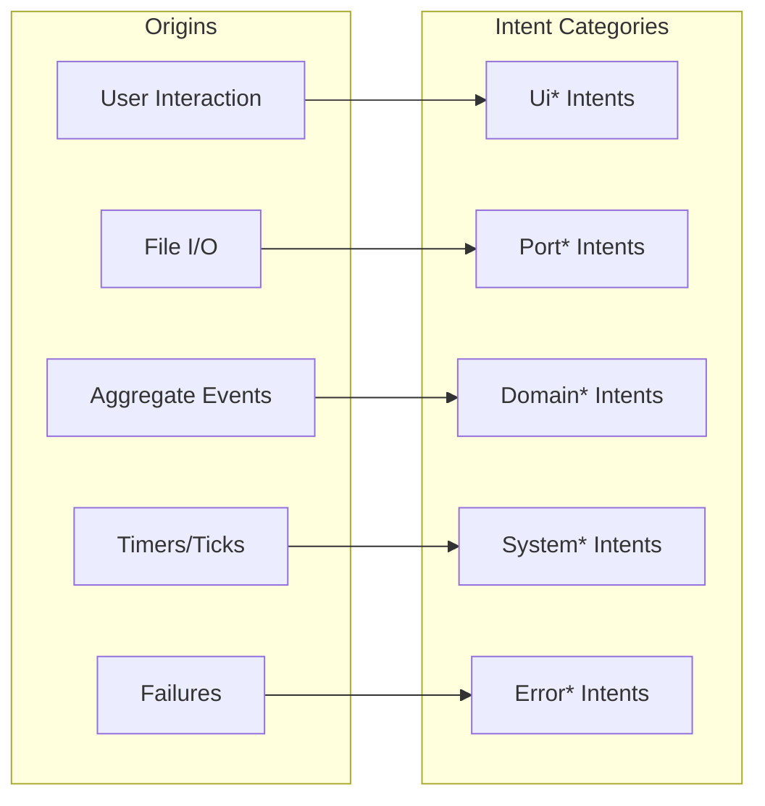
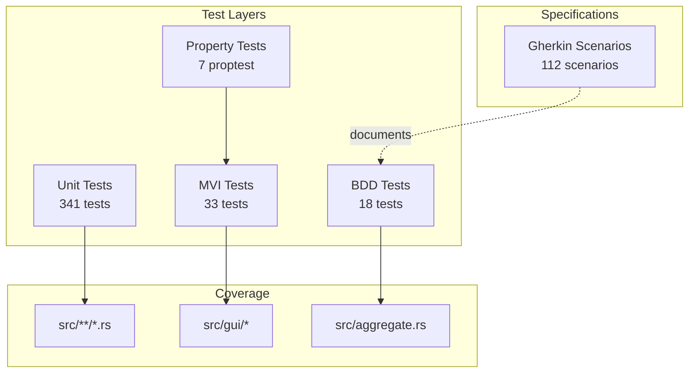
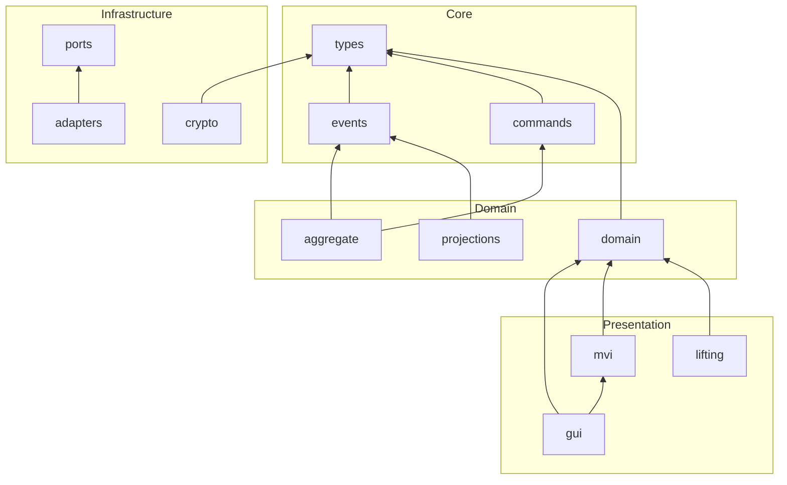

# CIM Keys Architecture

<!-- Copyright (c) 2025 - Cowboy AI, LLC. -->

## System Overview



## Domain Model



## Event Flow



## LiftableDomain Pattern

```mermaid
graph TB
    subgraph "Domain Types"
        O[Organization]
        OU[OrganizationUnit]
        P[Person]
        L[Location]
    end

    subgraph "Lifting Functor"
        LIFT[LiftableDomain::lift]
        UNLIFT[LiftableDomain::unlift]
    end

    subgraph "Lifted Graph"
        LN[LiftedNode]
        LE[LiftedEdge]
        LG[LiftedGraph]
    end

    O -->|lift()| LN
    OU -->|lift()| LN
    P -->|lift()| LN
    L -->|lift()| LN

    LN -->|unlift()| O
    LN -->|unlift()| OU
    LN -->|unlift()| P
    LN -->|unlift()| L

    LN --> LG
    LE --> LG
```

## MVI Intent Categorization



## Testing Architecture



## Projection Storage

```mermaid
graph TB
    subgraph "Encrypted SD Card"
        MAN[manifest.json]

        subgraph "domain/"
            ORG_J[organization.json]
            PEOPLE[people/]
            RELS[relationships.json]
        end

        subgraph "keys/"
            KEY_DIR[{key-id}/]
            META[metadata.json]
            PUB[public.pem]
        end

        subgraph "certificates/"
            ROOT_DIR[root-ca/]
            INT_DIR[intermediate-ca/]
            LEAF_DIR[leaf/]
        end

        subgraph "nats/"
            OP_DIR[operator/]
            ACC_DIR[accounts/]
            USR_DIR[users/]
        end

        subgraph "events/"
            DATE[{date}/]
            EVT_LOG[*.jsonl]
        end
    end
```

## FRP Axiom Compliance

| Axiom | Status | Implementation |
|-------|--------|----------------|
| A3: Decoupled | ✅ | `update()` output depends only on input |
| A4: Causality | ⚠️ | Runtime tracking via correlation_id |
| A5: Totality | ✅ | All `with_*` methods are total |
| A7: Event Logs | ✅ | Events stored as timestamped prefixes |
| A9: Composition | ✅ | Associativity verified by proptest |

## Module Dependencies



## Key Patterns

### 1. Command-Event Flow
```
CreatePerson → Aggregate.handle() → PersonCreated → Projection.apply()
```

### 2. Immutable Model Updates
```rust
model.with_tab(Tab::Organization)
     .with_person_added(person)
     .with_status(Status::Ready)
```

### 3. Intent Routing
```rust
match intent {
    Intent::UiTabSelected(tab) => // UI handler
    Intent::PortFileLoaded(data) => // Port handler
    Intent::DomainPersonCreated(p) => // Domain handler
}
```

### 4. LiftableDomain Functor
```rust
graph.add(&organization);  // Organization → LiftedNode
let orgs: Vec<Organization> = graph.unlift_all();  // LiftedNode → Organization
```
