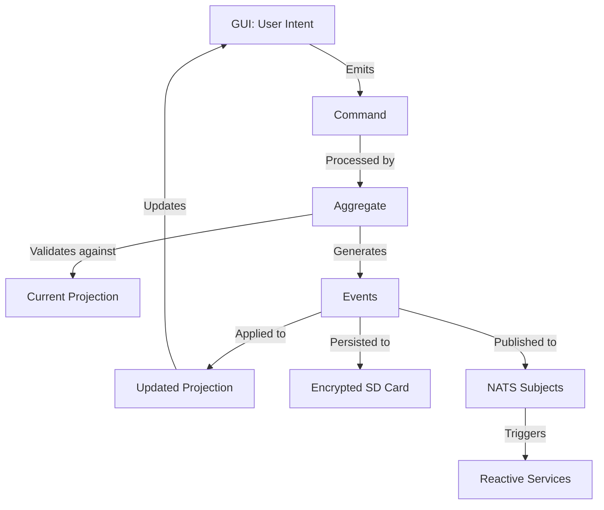

# CLAUDE.md

This file provides guidance to Claude Code (claude.ai/code) when working with code in this repository.

## 🔴 PRIME DIRECTIVE: CONTINUOUS LEARNING & BEST PRACTICES

**You are a constantly learning system. When you write your progress at natural breaks, you also:**

1. **ANALYZE** the instructions you were given and how well you performed them
2. **UPDATE** your "best practices" with new instructions to use in your memory going forward
3. **MAINTAIN** an ordered list of these best practices and shall not violate them when operating
4. **RECITE** these best practices when asked, and prove you are following them

### Current Best Practices (Updated Continuously):
1. **UUID v7 MANDATE**: Always use `Uuid::now_v7()` for time-ordered UUIDs, NEVER v4 or v5
2. **Event Sourcing Pattern**: All state changes through immutable events, no CRUD operations
3. **NATS JetStream for Testing**: Use real event stores for workflow validation, not artificial unit tests
4. **Progress Documentation**: Create and maintain PROGRESS_LOG.md at every significant checkpoint
5. **Domain Module Pattern**: Define boundaries → Event storm → Create aggregates → Design sagas → Implement services
6. **Saga State Machines**: Implement sagas as aggregates of aggregates with Markov chain transitions
7. **Test-First for Policies**: Create comprehensive TDD tests for PKI and authorization before implementation
8. **MessageIdentity Creation**: Use cim_domain's factory methods, not direct construction
9. **Compilation Before Proceeding**: Always fix compilation errors before moving to new features
10. **Context Awareness**: Check which repository/module you're in before making changes
11. **MVI Pattern for GUI**: Use Model-View-Intent architecture with explicit event source categorization
12. **Pure Update Functions**: Update functions must be pure - NO side effects except in Commands
13. **Immutable Model Updates**: Use `with_*` methods that return new instances, NEVER mutate
14. **Clone Before Move**: Clone model fields BEFORE calling methods that consume model
15. **Intent Naming**: Prefix intents with origin: `Ui*`, `Port*`, `Domain*`, `System*`, `Error*`
16. **Port Dependency Injection**: Inject ports into update function, call through Commands only
17. **Hex Field Access**: Use correct field names (`data` not `key_data`, `data` not `public_key`)

## 🔴 CRITICAL DIRECTIVE: PROGRESS LOGGING

**YOU MUST maintain a progress log at EVERY natural break point:**
- After completing each file modification
- Before switching between major components
- When encountering errors or design decisions
- At the end of each work session

Use TodoWrite tool to track:
1. What was just completed
2. What is currently being worked on
3. What needs to be done next
4. Any blockers or decisions needed

**NEVER proceed without updating the todo list when switching tasks**

## Comprehensive System Design

### Event Flow Architecture



### Complete Domain Model

```rust
// The trinity of domain entities
Organization (Root Entity)
├── OrganizationUnits (Departments/Teams)
├── People (Members with Roles)
└── Locations (Physical/Logical)

// Key ownership flows through this graph
Person --[owns]--> Key
Person --[delegates-to]--> Person
Key --[stored-at]--> Location
Key --[signs]--> Certificate
Certificate --[trusts]--> Certificate
Organization --[operates]--> NatsOperator
OrganizationUnit --[maps-to]--> NatsAccount
Person --[maps-to]--> NatsUser
```

### GUI Screen Flow (Event-Driven)

1. **Welcome Screen**
   - Load existing domain config → `DomainConfigLoadedEvent`
   - Create new domain → `DomainCreationInitiatedEvent`

2. **Organization Graph Screen** (PRIMARY VIEW)
   - Visualizes people as nodes, relationships as edges
   - Click person → `PersonSelectedEvent`
   - Add relationship → `RelationshipEstablishedEvent`
   - Assign YubiKey → `YubiKeyAssignedToPersonEvent`

3. **Key Generation Screen**
   - Generate root CA → `RootCAGeneratedEvent`
   - Generate person keys → `KeyGeneratedForPersonEvent`
   - Provision YubiKey → `YubiKeyProvisionedEvent`

4. **Export Screen**
   - Export to SD card → `DomainExportedEvent`
   - Generate manifest → `ManifestCreatedEvent`

### Event Patterns for Key Operations

```rust
// Example: Generating a key for a person
PersonIntendsToGenerateKey {
    person_id: Uuid,
    key_purpose: KeyPurpose,
    correlation_id: Uuid,
    causation_id: Option<Uuid>,
    timestamp: DateTime<Utc>,
}
  ↓
KeyGenerationValidated {
    person_has_permission: bool,
    yubikey_available: bool,
    slot_available: bool,
}
  ↓
YubiKeySlotAllocated {
    yubikey_serial: String,
    slot: PIVSlot,
    person_id: Uuid,
}
  ↓
KeyMaterialGenerated {
    key_id: Uuid,
    algorithm: KeyAlgorithm,
    public_key: Vec<u8>,
}
  ↓
KeyOwnershipEstablished {
    key_id: Uuid,
    person_id: Uuid,
    organization_id: Uuid,
    valid_from: DateTime<Utc>,
    valid_until: Option<DateTime<Utc>>,
}
```

### Projection Structure on Encrypted SD Card

```
/mnt/encrypted/cim-keys/
├── manifest.json                    # Master index
├── domain/
│   ├── organization.json           # Org structure
│   ├── people.json                 # All people
│   ├── locations.json              # Storage locations
│   └── relationships.json          # Graph edges
├── keys/
│   ├── {key-id}/
│   │   ├── metadata.json
│   │   ├── public.pem
│   │   └── ownership.json
├── certificates/
│   ├── root-ca/
│   ├── intermediate-ca/
│   └── leaf/
├── nats/
│   ├── operator/
│   ├── accounts/
│   └── users/
├── events/
│   ├── 2025-01-01/                # Daily event logs
│   │   ├── 001-domain-created.json
│   │   ├── 002-person-added.json
│   │   └── ...
└── audit/
    └── access.log                   # Who accessed what when
```

## Critical Architecture Understanding

### This is NOT a Traditional Key Management System

**cim-keys is the genesis point for CIM infrastructures**. It creates the initial domain (organizations, people, locations) AND their cryptographic keys as a unified bootstrap package. This system:

1. **Owns domain creation** - Creates the foundational organizational structure
2. **Generates all root keys** - Offline, air-gapped key generation
3. **Projects to encrypted SD cards** - The SD card IS the database
4. **Bootstrap other CIM components** - Other modules import from cim-keys, not vice versa

### Event-Sourced FRP Architecture (MANDATORY)

This codebase follows **Functional Reactive Programming with Event Sourcing**:
- **NO mutable state** - State is projected from immutable events
- **NO CRUD operations** - Only domain events (PersonJoinedOrganization, KeyGeneratedForPerson, etc.)
- **Commands → Events → Projections** - All changes flow through this pipeline
- **Offline-first** - Events stored as JSON on encrypted partitions

## Build Commands

```bash
# Enter Nix development shell (REQUIRED - provides all dependencies)
nix develop

# Build native application
cargo build --release --features gui

# Build for WASM (browser deployment)
./build-wasm.sh

# Run native GUI
cargo run --bin cim-keys-gui -- /path/to/output/dir

# Run CLI
cargo run --bin cim-keys -- --help

# Run tests
cargo test --all-features

# Check compilation without YubiKey dependencies
cargo check --features gui --no-default-features
```

## Architecture Layers

### 1. Domain Layer (`src/domain.rs`)
**Master domain definitions** - Organizations, People, Locations, and their relationships. This is THE authoritative source, not dependent on external cim-domain-* modules.

### 2. Event Layer (`src/events.rs`)
Immutable facts about what happened. Every event includes:
- `correlation_id` - Links related events
- `causation_id` - What caused this event
- Domain context (ownership, storage location)

### 3. Command Layer (`src/commands.rs`)
Intentions to change state. Commands include `KeyContext` linking to domain entities.

### 4. Aggregate Layer (`src/aggregate.rs`)
Pure functions: `Command + Projection → Vec<Event>`
No mutable state, no side effects except through ports.

### 5. Projection Layer (`src/projections.rs`)
Materializes current state from events to JSON files on encrypted partition:
```
/mnt/encrypted/
├── manifest.json
├── keys/
├── certificates/
├── events/
└── nats/
```

### 6. Ports & Adapters
- `ports/nats.rs` - Interface for NATS operations
- `adapters/nsc.rs` - NSC implementation of NATS port

### 7. GUI Layer (`src/gui.rs`, `src/gui/graph.rs`)
Iced 0.13+ application that:
- Compiles to both native and WASM
- Visualizes organization as a graph (nodes=people, edges=relationships)
- Emits commands, observes projections

## CIM Communication Principles

**MUST follow CIM-DEVELOPMENT-GUIDELINES.md**

Key points:
1. **Everything uses NATS subjects**: `organization.unit.entity.operation`
2. **Graph relationships**: People and delegations form a directed graph
3. **Temporal validity**: All relationships have time boundaries
4. **Event choreography**: Services react to events independently

Example NATS subjects:
```
cowboyai.security.keys.certificate.generate.root
cowboyai.infrastructure.nats.operator.create
cowboyai.security.audit.key.revoked
```

## Domain Bootstrap Flow

1. **Load/Create Domain** (`secrets/domain-bootstrap.json`)
   - Organizations with units
   - People with roles and permissions
   - Physical locations for key storage
   - YubiKey assignments

2. **Generate Key Hierarchy**
   - Root CA keys (stored on primary YubiKey)
   - Intermediate CAs per organizational unit
   - Personal keys for each person
   - NATS operator/account/user keys

3. **Project to Encrypted Storage**
   - All events written to JSON
   - Manifest tracks all artifacts
   - Ready for import by CIM leaves/clusters

## YubiKey Integration

Three-level PKI mapped to YubiKeys:
- **Operator Level**: Root authority, system operations
- **Domain Level**: Organizational administration
- **User Level**: Individual operations

PIV Slots:
- 9A: Authentication
- 9C: Digital Signature
- 9D: Key Management
- 9E: Card Authentication

## Testing Approach

```bash
# Unit tests for pure functions
cargo test --lib

# Integration tests with mock NATS
cargo test --test integration

# GUI testing (native)
cargo run --bin cim-keys-gui -- ./test-output

# WASM testing
./build-wasm.sh && ./serve.py
```

## Key Files to Understand

- `src/domain.rs` - Master domain model (org structure)
- `src/aggregate.rs` - Command processing logic
- `src/projections.rs` - How state is persisted
- `src/gui/graph.rs` - Organizational graph visualization
- `secrets/domain-bootstrap.json` - Example bootstrap configuration

## Development Workflow

1. Domain changes start in `src/domain.rs`
2. Add corresponding events in `src/events.rs`
3. Add commands in `src/commands.rs`
4. Implement handlers in `src/aggregate.rs`
5. Update projections in `src/projections.rs`
6. GUI updates in `src/gui.rs` emit commands, never direct calls

## Implementation Patterns

### Adding a New Feature - MANDATORY STEPS

1. **Define the Domain Model** (`src/domain.rs`)
   ```rust
   struct NewEntity {
       id: Uuid,
       // relationships to Organization, Person, Location
   }
   ```

2. **Create Events** (`src/events.rs`)
   ```rust
   struct EntityCreatedEvent {
       entity_id: Uuid,
       correlation_id: Uuid,
       causation_id: Option<Uuid>,
       timestamp: DateTime<Utc>,
       // domain context
   }
   ```

3. **Define Commands** (`src/commands.rs`)
   ```rust
   struct CreateEntityCommand {
       context: KeyContext,  // Links to domain
       // intent parameters
   }
   ```

4. **Implement Handler** (`src/aggregate.rs`)
   ```rust
   fn handle_create_entity(cmd) -> Result<Vec<Event>, Error> {
       // Validate against projection
       // Generate events (no side effects!)
   }
   ```

5. **Update Projection** (`src/projections.rs`)
   ```rust
   fn apply_event(event: EntityCreatedEvent) {
       // Write to JSON on encrypted partition
       // Update manifest
   }
   ```

6. **GUI Integration** (`src/gui.rs`)
   ```rust
   // GUI only emits commands, never direct calls
   Message::UserIntent -> Command -> Event flow
   ```

### Design Checklist for EVERY Change

- [ ] Does it follow event-sourced pattern?
- [ ] Are all events immutable with correlation/causation IDs?
- [ ] Is state only in projections (JSON files)?
- [ ] Does GUI only emit commands?
- [ ] Are domain relationships modeled as graph edges?
- [ ] Will it work offline?
- [ ] Can state be reconstructed from events?
- [ ] Are NATS subjects semantic (not technical)?
- [ ] Is temporal validity considered?
- [ ] Does it compile to WASM?

## Important Constraints

- **Air-gapped operation** - Must work completely offline
- **No network dependencies** - All resources embedded
- **Encrypted storage only** - Keys never touch unencrypted disk
- **Event replay** - Must reconstruct state from event history
- **WASM compatibility** - Keep dependencies WASM-compatible
- **Graph visualization primary** - Organization IS a graph, not a hierarchy
- **Time is always present** - Every relationship has temporal bounds