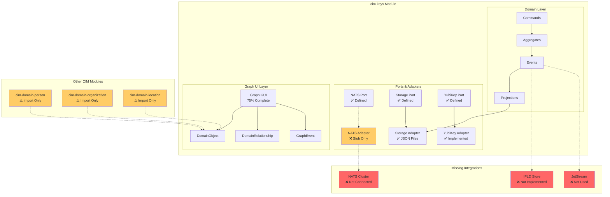
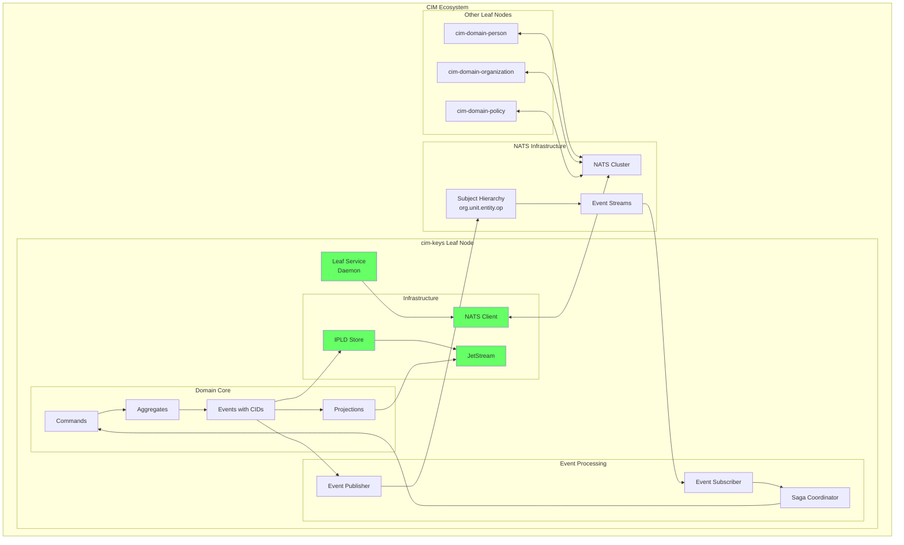
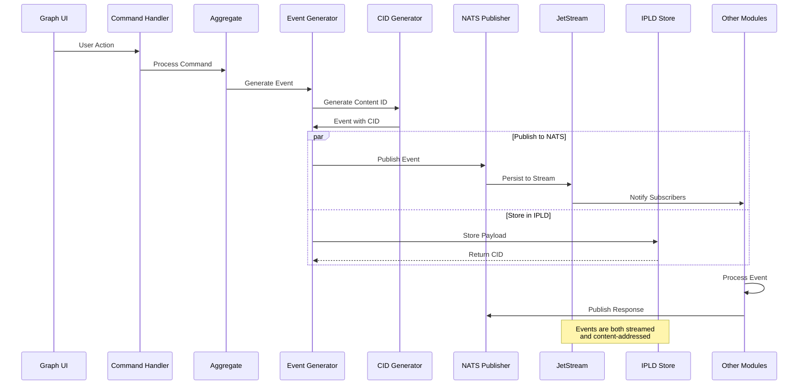
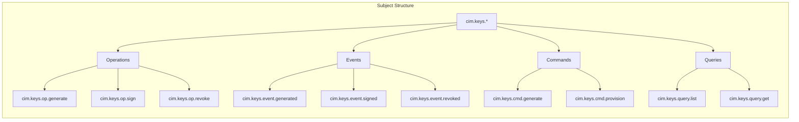
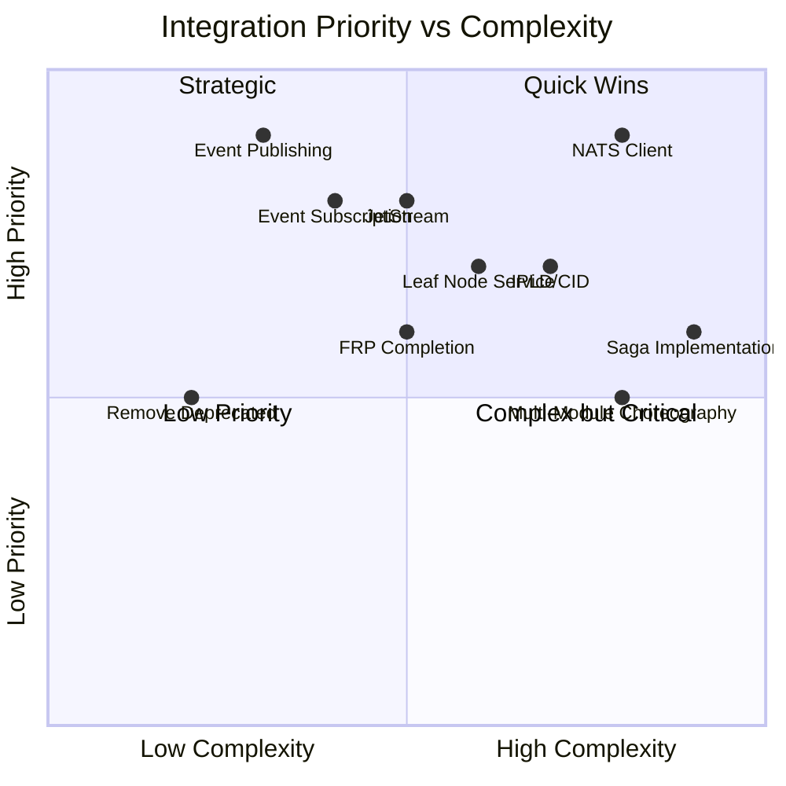
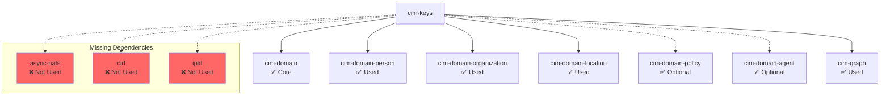

# CIM Keys Architecture & Integration Points

## Current Architecture (Partial Integration)

## Required CIM Integration Architecture

## Event Flow with Proper CIM Integration

## NATS Subject Hierarchy for cim-keys

## Integration Priority Matrix

## Module Dependency Graph

## Key Integration Points Summary

| Component | Status | Required Action | Priority |
|-----------|--------|-----------------|----------|
| NATS Client | ❌ Stub Only | Implement real client | CRITICAL |
| Event Publishing | ❌ Local Only | Publish to NATS subjects | CRITICAL |
| Event Subscription | ❌ None | Subscribe to external events | HIGH |
| IPLD/CID | ❌ Not Implemented | Add content addressing | HIGH |
| JetStream | ❌ Not Used | Persist events to streams | HIGH |
| Leaf Node Service | ⚠️ Example Only | Create daemon service | MEDIUM |
| Saga Coordinator | ❌ None | Implement workflows | MEDIUM |
| Graph UI | ✅ 75% Complete | Finish migration | MEDIUM |
| FRP Axioms | ⚠️ 50% Complete | Implement missing axioms | LOW |

## Legend
- ✅ Implemented and working
- ⚠️ Partially implemented
- ❌ Not implemented / Critical gap
- Solid lines: Active connections
- Dotted lines: Missing/planned connections