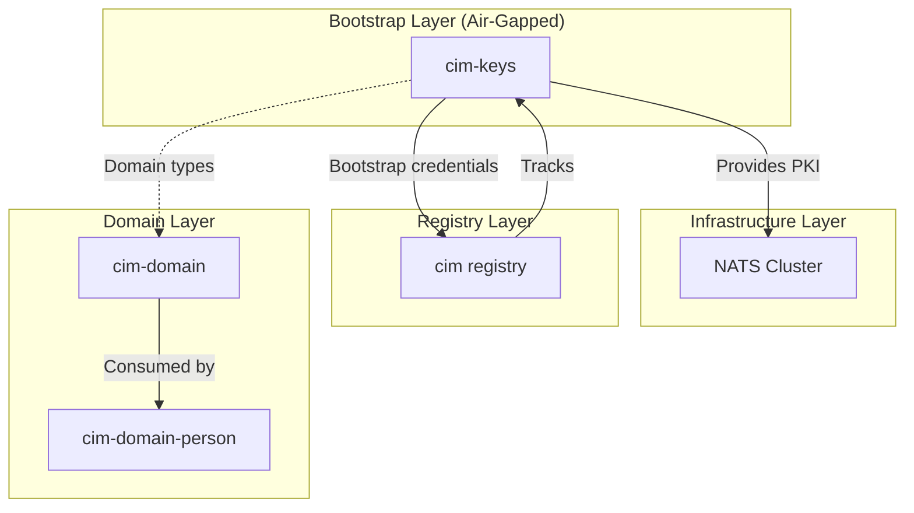

# CIM Registry Integration Guide

## Overview

`cim-keys` is the **genesis module** for CIM infrastructure. It creates:
- Root PKI hierarchy (CA certificates)
- NATS operator/account/user credentials
- Initial domain structure (organizations, people, locations)
- YubiKey provisioning for hardware security

**Bootstrap Order**: 1 (must run BEFORE deploying NATS cluster)

---

## Module Registration

Add to `/git/thecowboyai/cim/modules.json`:

```json
{
  "cim-keys": {
    "repository": "https://github.com/thecowboyai/cim-keys",
    "version": "0.9.0",
    "category": "security",
    "bootstrap_order": 1,
    "requires_air_gap": true,
    "description": "PKI and credential bootstrap for CIM infrastructure"
  }
}
```

---

## Exported Types

### Domain Entities

```rust
// Core domain types
pub use cim_keys::domain::{
    Organization,
    OrganizationUnit,
    OrganizationUnitType,
    Person,
    Location,
    LocationType,
    Role,
    Policy,
    KeyOwnerRole,
};
```

### Graph Types (DomainNode Coproduct)

```rust
// Categorical coproduct for graph visualization
pub use cim_keys::gui::domain_node::{
    DomainNode,       // The coproduct type
    DomainNodeData,   // Inner data enum for pattern matching
    Injection,        // Type discriminator enum
    FoldDomainNode,   // Universal property trait
    FoldVisualization, // Visualization folder
    VisualizationData, // Rendered node data
};

// Graph structure
pub use cim_keys::gui::graph::{
    ConceptEntity,        // Graph node with position
    ConceptRelation,      // Graph edge
    OrganizationConcept,  // Complete graph
    EdgeType,             // Relationship types
};
```

### Events

```rust
pub use cim_keys::events::{
    // Key events
    RootCaGenerated,
    IntermediateCaGenerated,
    LeafCertificateGenerated,
    KeyGeneratedForPerson,

    // NATS events
    NatsOperatorCreated,
    NatsAccountCreated,
    NatsUserCreated,

    // YubiKey events
    YubiKeyProvisioned,
    PivSlotAssigned,

    // Domain events
    OrganizationCreated,
    PersonAddedToOrganization,
    DelegationEstablished,
};
```

---

## Usage Patterns

### Pattern 1: Creating Domain Entities

```rust
use cim_keys::domain::{Organization, Person, KeyOwnerRole};
use uuid::Uuid;
use std::collections::HashMap;

// Create organization
let org = Organization {
    id: Uuid::now_v7(),
    name: "cowboyai".to_string(),
    display_name: "Cowboy AI, LLC".to_string(),
    description: Some("AI infrastructure company".to_string()),
    parent_id: None,
    units: vec![],
    metadata: HashMap::new(),
};

// Create person
let person = Person {
    id: Uuid::now_v7(),
    name: "Alice Smith".to_string(),
    email: "alice@cowboyai.com".to_string(),
    roles: vec![],
    organization_id: org.id,
    unit_ids: vec![],
    active: true,
    nats_permissions: None,
    owner_id: None,
};
```

### Pattern 2: Using DomainNode Coproduct

```rust
use cim_keys::gui::domain_node::{DomainNode, Injection, DomainNodeData, FoldVisualization};
use cim_keys::domain::KeyOwnerRole;

// Inject entity into coproduct
let node = DomainNode::inject_person(person, KeyOwnerRole::Developer);

// Type discrimination (fast - O(1))
match node.injection() {
    Injection::Person => println!("This is a person node"),
    Injection::Organization => println!("This is an org node"),
    Injection::RootCertificate => println!("This is a root CA"),
    _ => println!("Other node type"),
}

// Helper methods for category checking
if node.injection().is_nats() {
    println!("NATS infrastructure node");
}
if node.injection().is_certificate() {
    println!("PKI certificate node");
}
if node.injection().is_yubikey() {
    println!("YubiKey hardware node");
}

// Pattern matching on data (when you need the actual values)
match node.data() {
    DomainNodeData::Person { person, role } => {
        println!("Person: {} ({})", person.name, role);
    }
    DomainNodeData::Organization(org) => {
        println!("Organization: {}", org.name);
    }
    _ => {}
}

// Universal property: fold to any type
let viz = node.fold(&FoldVisualization);
println!("Label: {}", viz.primary_text);
println!("Color: {:?}", viz.color);
```

### Pattern 3: Building Organization Graphs

```rust
use cim_keys::gui::graph::{OrganizationConcept, EdgeType};
use cim_keys::domain::{Organization, OrganizationUnit, OrganizationUnitType};

// Create graph
let mut graph = OrganizationConcept::new();

// Add organization (root)
graph.add_organization_node(org);

// Add organizational unit
let unit = OrganizationUnit {
    id: Uuid::now_v7(),
    name: "Engineering".to_string(),
    unit_type: OrganizationUnitType::Department,
    parent_unit_id: None,
    responsible_person_id: None,
    nats_account_name: None,
};
graph.add_org_unit_node(unit);

// Add person with role
graph.add_node(person, KeyOwnerRole::Developer);

// Add edge (relationship)
graph.add_edge(org.id, unit.id, EdgeType::ManagesUnit);
graph.add_edge(person.id, unit.id, EdgeType::MemberOf);
```

### Pattern 4: Subscribing to Events

```rust
// NATS subjects for cim-keys events
const SUBJECTS: &[&str] = &[
    "thecowboyai.security.keys.*",
    "thecowboyai.security.certificates.*",
    "thecowboyai.security.nats.*",
    "thecowboyai.security.yubikey.*",
    "thecowboyai.security.domain.*",
];

async fn subscribe_to_key_events(nats: &async_nats::Client) -> Result<()> {
    for subject in SUBJECTS {
        let mut sub = nats.subscribe(*subject).await?;
        tokio::spawn(async move {
            while let Some(msg) = sub.next().await {
                // Process event
                let event_type = msg.headers
                    .and_then(|h| h.get("event-type"))
                    .map(|v| v.to_string());

                println!("Received: {:?} on {}", event_type, subject);
            }
        });
    }
    Ok(())
}
```

---

## NATS Subject Algebra

### Subject Pattern

```
<organization>.<unit>.<domain>.<entity>.<operation>
```

### Defined Subjects

| Subject | Description |
|---------|-------------|
| `thecowboyai.security.keys.root-ca.generated` | Root CA key generated |
| `thecowboyai.security.keys.user.generated` | User key generated |
| `thecowboyai.security.keys.revoked` | Key revoked |
| `thecowboyai.security.certificates.issued` | Certificate issued |
| `thecowboyai.security.certificates.revoked` | Certificate revoked |
| `thecowboyai.security.nats.operator.created` | NATS operator created |
| `thecowboyai.security.nats.account.created` | NATS account created |
| `thecowboyai.security.nats.user.created` | NATS user created |
| `thecowboyai.security.yubikey.provisioned` | YubiKey provisioned |
| `thecowboyai.security.domain.organization.created` | Organization created |
| `thecowboyai.security.domain.person.added` | Person added |

---

## Dependency Graph



---

## Compliance Status

| Category | Score | Notes |
|----------|-------|-------|
| ACT Categorical | 72% | Coproduct structure correct, fold uniqueness needs fix |
| DDD Modeling | 42% | Bounded contexts need separation |
| CIM Architecture | 60% | NATS subjects needed |
| Test Coverage | 95% | 271 tests passing |

---

## Future Improvements

1. **Pure fold function** - Replace trait-based fold with FnOnce closures
2. **Bounded context separation** - Extract PKI, NATS, YubiKey modules
3. **LiftableDomain trait** - Enable formal CIM registry integration
4. **JetStream persistence** - Store events in NATS instead of filesystem

---

## Contact

Repository: https://github.com/thecowboyai/cim-keys
Maintainer: Cowboy AI, LLC
