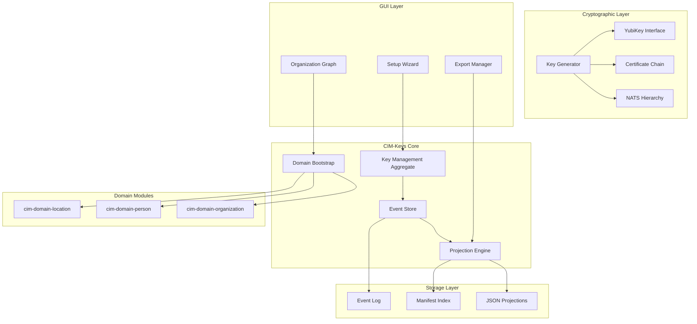
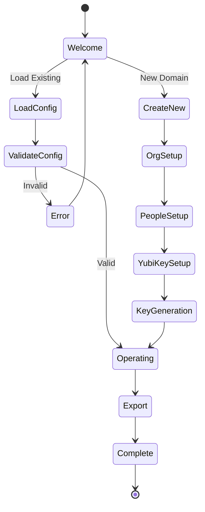
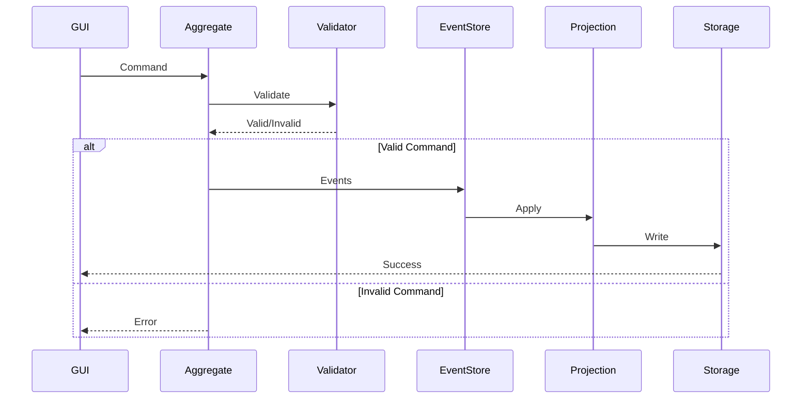
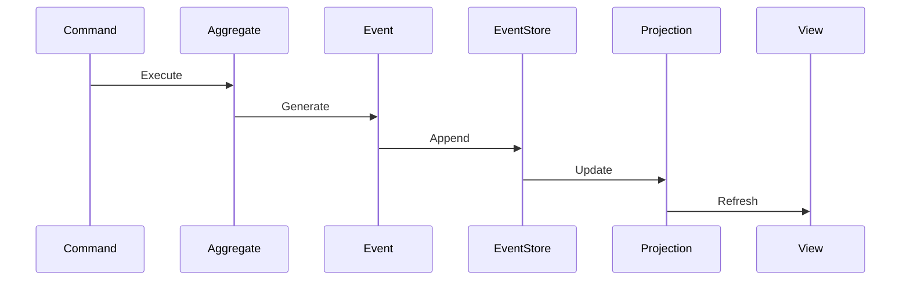
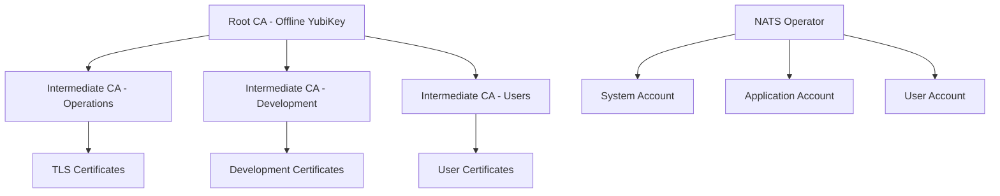

# CIM-Keys Architecture Design Document

## System Architecture Overview



## Component Design

### 1. Domain Bootstrap System

The bootstrap system is the entry point for creating a new CIM infrastructure.

```rust
pub struct DomainBootstrap {
    config: DomainConfig,
    validator: ConfigValidator,
    builder: DomainBuilder,
}

pub struct DomainConfig {
    version: String,
    organization: OrganizationConfig,
    people: Vec<PersonConfig>,
    yubikeys: Vec<YubiKeyConfig>,
    locations: Vec<LocationConfig>,
}
```

**Responsibilities:**
- Load and validate configuration files
- Create organizational structure
- Establish person-role mappings
- Assign YubiKeys to operators
- Define storage locations

**Evaluation Points:**
- Config validation completeness
- Circular dependency detection
- Role permission validation
- YubiKey assignment conflicts

### 2. Event-Sourced Aggregate

The aggregate handles all state changes through events.

```rust
pub struct KeyManagementAggregate {
    id: Uuid,
    version: u64,
    projection: CurrentProjection,
}

impl KeyManagementAggregate {
    pub fn handle_command(&self, cmd: Command) -> Result<Vec<Event>, Error> {
        match cmd {
            Command::GenerateKey(cmd) => self.generate_key(cmd),
            Command::AssignOwnership(cmd) => self.assign_ownership(cmd),
            Command::DelegateAuthority(cmd) => self.delegate_authority(cmd),
            Command::RevokeKey(cmd) => self.revoke_key(cmd),
        }
    }
}
```

**Event Flow:**
```
Command → Validate → Generate Events → Apply to Projection → Persist
```

**Evaluation Points:**
- Command validation thoroughness
- Event generation consistency
- Idempotency guarantees
- Concurrency handling

### 3. Cryptographic Operations

Multi-backend key generation with hardware support.

```rust
pub trait KeyBackend: Send + Sync {
    async fn generate_key(&self, spec: KeySpec) -> Result<KeyPair, Error>;
    async fn sign(&self, key_id: &str, data: &[u8]) -> Result<Signature, Error>;
    async fn verify(&self, key_id: &str, data: &[u8], sig: &Signature) -> Result<bool, Error>;
}

pub struct KeyGenerator {
    hardware: Option<Box<dyn KeyBackend>>,  // YubiKey
    software: Box<dyn KeyBackend>,          // Software HSM
    policy: KeyGenerationPolicy,
}
```

**Key Hierarchy:**
```
Root CA (YubiKey 9e)
├── Intermediate CA - Operations (YubiKey 9d)
│   ├── TLS Server Certs
│   └── TLS Client Certs
├── Intermediate CA - Development (Software)
│   └── Development Certs
└── Intermediate CA - Users (YubiKey 9c)
    └── User Authentication Certs

NATS Hierarchy:
Operator Key (YubiKey)
├── System Account
│   └── System User
├── Application Account
│   └── Service Users
└── User Account
    └── Individual Users

SSH Keys:
├── Host Keys (Ed25519)
├── User Keys (Ed25519/RSA)
└── Deploy Keys (Ed25519)
```

**Evaluation Points:**
- Key generation speed
- Certificate validation
- Chain of trust integrity
- Hardware fallback handling

### 4. Storage & Projection System

Deterministic projection to encrypted filesystem.

```rust
pub struct ProjectionEngine {
    projectors: Vec<Box<dyn Projector>>,
    encryptor: StorageEncryptor,
    layout: StorageLayout,
}

pub trait Projector: Send + Sync {
    fn project(&self, events: &[Event]) -> Result<ProjectionData, Error>;
    fn supports_event(&self, event: &Event) -> bool;
}
```

**Storage Layout:**
```
/mnt/encrypted/cim-keys/
├── manifest.json                    # Master index with checksums
├── version.json                     # Schema version info
├── domain/
│   ├── organization.json           # Organizational structure
│   ├── people.json                 # Person registry
│   ├── locations.json              # Storage locations
│   └── relationships.json          # Graph edges
├── keys/
│   ├── {key-id}/
│   │   ├── metadata.json          # Key metadata
│   │   ├── public.pem             # Public key material
│   │   ├── certificate.pem        # Certificate (if applicable)
│   │   └── ownership.json         # Ownership chain
│   └── index.json                 # Key index
├── certificates/
│   ├── root-ca/
│   │   ├── cert.pem
│   │   └── chain.pem
│   ├── intermediate/
│   │   └── {name}/
│   │       ├── cert.pem
│   │       └── chain.pem
│   └── leaf/
│       └── {id}/
│           └── cert.pem
├── nats/
│   ├── operator/
│   │   ├── operator.jwt
│   │   └── operator.nkey
│   ├── accounts/
│   │   └── {account}/
│   │       ├── account.jwt
│   │       └── account.nkey
│   └── users/
│       └── {user}/
│           ├── user.jwt
│           └── user.creds
├── events/
│   ├── 2025-10-22/
│   │   ├── 00001-bootstrap.json
│   │   ├── 00002-org-created.json
│   │   └── ...
│   └── checkpoint.json            # Last processed event
└── audit/
    ├── access.log                 # Access audit log
    └── operations.log             # Operation audit log
```

**Evaluation Points:**
- Projection determinism
- Storage efficiency
- Encryption correctness
- Manifest accuracy

### 5. GUI Architecture

Native and WASM-compatible interface using Iced 0.13.

```rust
pub struct CimKeysApp {
    state: AppState,
    screens: ScreenManager,
    graph: OrganizationGraph,
    event_bus: EventBus,
}

pub enum AppState {
    Welcome,
    Loading { progress: f32 },
    Configuring { wizard: WizardState },
    Operating { domain: Domain },
    Exporting { manifest: Manifest },
}
```

**Screen Flow:**


**Evaluation Points:**
- Navigation flow completeness
- Error handling coverage
- Graph visualization accuracy
- Export completeness

### 6. Integration Points

#### Domain Module Integration
```rust
pub struct DomainIntegrator {
    org_adapter: OrganizationAdapter,
    person_adapter: PersonAdapter,
    location_adapter: LocationAdapter,
}

impl DomainIntegrator {
    pub fn map_organization(&self, config: &OrgConfig) -> Organization {
        self.org_adapter.from_config(config)
    }

    pub fn map_person(&self, config: &PersonConfig) -> Person {
        self.person_adapter.from_config(config)
    }

    pub fn validate_relationships(&self) -> Result<(), Error> {
        // Cross-domain validation
    }
}
```

#### NATS Integration
```rust
pub struct NatsIntegration {
    subject_generator: SubjectGenerator,
    message_router: MessageRouter,
}

impl NatsIntegration {
    pub fn generate_subjects(&self, domain: &Domain) -> Vec<Subject> {
        // Generate NATS subjects from domain structure
    }

    pub fn route_event(&self, event: &Event) -> Subject {
        // Determine routing for event
    }
}
```

**Evaluation Points:**
- Adapter completeness
- Cross-domain validation
- Subject generation accuracy
- Message routing correctness

## Data Flow Architecture

### Command Processing Flow


### Event Sourcing Flow


## Security Architecture

### Defense in Depth
```
Layer 1: Physical Security
├── YubiKey possession
└── Encrypted storage media

Layer 2: Cryptographic Security
├── Hardware key generation
├── Certificate validation
└── Signature verification

Layer 3: Application Security
├── Event validation
├── Permission checks
└── Audit logging

Layer 4: Operational Security
├── Offline operation
├── Air-gapped generation
└── Secure export
```

### Trust Model


## Performance Architecture

### Optimization Strategies

1. **Parallel Key Generation**
   ```rust
   pub async fn generate_keys_parallel(specs: Vec<KeySpec>) -> Vec<Result<KeyPair, Error>> {
       futures::future::join_all(
           specs.into_iter()
               .map(|spec| async move { generate_key(spec).await })
       ).await
   }
   ```

2. **Event Batching**
   ```rust
   pub struct EventBatcher {
       buffer: Vec<Event>,
       max_size: usize,
       max_wait: Duration,
   }
   ```

3. **Projection Caching**
   ```rust
   pub struct ProjectionCache {
       snapshots: LruCache<u64, Projection>,
       events_since: HashMap<u64, Vec<Event>>,
   }
   ```

### Performance Targets

| Operation | Target | Maximum |
|-----------|--------|---------|
| RSA-2048 Generation | 50ms | 100ms |
| RSA-4096 Generation | 200ms | 500ms |
| Ed25519 Generation | 5ms | 10ms |
| 1K Event Projection | 500ms | 1s |
| 10K Event Replay | 2s | 5s |
| GUI Response | 16ms | 100ms |
| YubiKey Operation | 100ms | 500ms |

## Testing Architecture

### Test Pyramid
```
         E2E Tests (10%)
        /           \
    Integration (25%)
      /         \
    Unit Tests (65%)
```

### Mock Strategy
```rust
// YubiKey Mock
pub struct MockYubiKey {
    behavior: MockBehavior,
    keys: HashMap<PIVSlot, MockKey>,
}

// Event Store Mock
pub struct MockEventStore {
    events: Vec<Event>,
    should_fail: bool,
}

// Projection Mock
pub struct MockProjection {
    data: ProjectionData,
    deterministic: bool,
}
```

## Deployment Architecture

### Binary Distribution
```
cim-keys/
├── cim-keys             # Main binary
├── cim-keys-gui         # GUI binary
├── libcim_keys.so       # Shared library
└── cim-keys.wasm        # WASM module
```

### Container Support
```dockerfile
FROM rust:1.90 AS builder
WORKDIR /build
COPY . .
RUN cargo build --release --features gui

FROM debian:bookworm-slim
COPY --from=builder /build/target/release/cim-keys /usr/local/bin/
ENTRYPOINT ["cim-keys"]
```

## Monitoring & Observability

### Metrics
```rust
pub struct Metrics {
    keys_generated: Counter,
    events_processed: Counter,
    projection_time: Histogram,
    errors: Counter,
}
```

### Audit Events
```rust
pub enum AuditEvent {
    DomainCreated { by: String, at: DateTime },
    KeyGenerated { type: KeyType, owner: String },
    CertificateSigned { subject: String, issuer: String },
    ExportCompleted { manifest: String },
}
```

## Migration & Compatibility

### Version Migration
```rust
pub trait MigrationStrategy {
    fn can_migrate(&self, from: Version, to: Version) -> bool;
    fn migrate(&self, data: &ProjectionData) -> Result<ProjectionData, Error>;
}
```

### Backward Compatibility
- Event schema versioning
- Projection format versioning
- API versioning

## Conclusion

This architecture provides:
1. **Clear separation of concerns** between components
2. **Event-sourced design** for auditability
3. **Hardware security** with software fallback
4. **Offline-first** operation
5. **Deterministic** projections
6. **Comprehensive** testing strategy
7. **Performance** optimization paths
8. **Security** at multiple layers

The design ensures cim-keys can reliably serve as the genesis point for CIM infrastructures while maintaining security, performance, and usability.