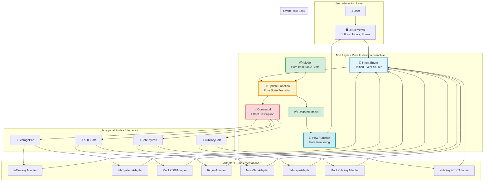
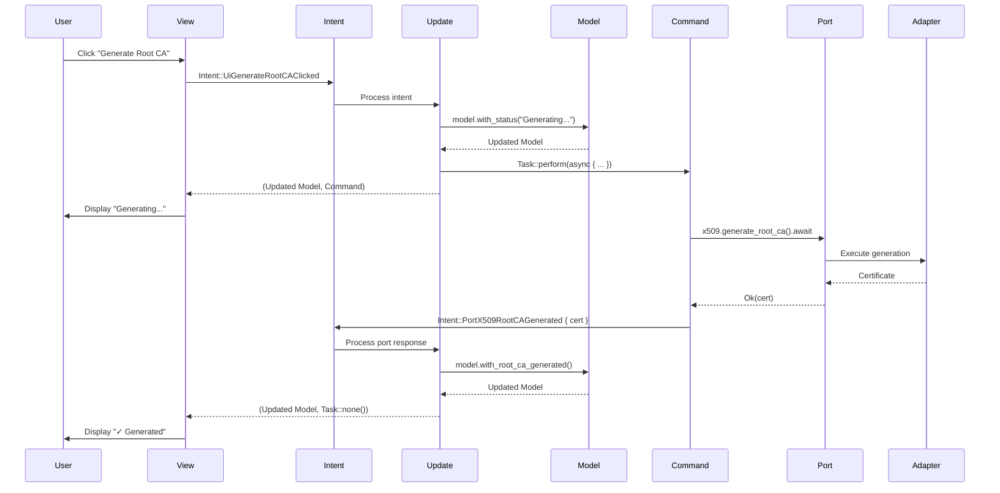
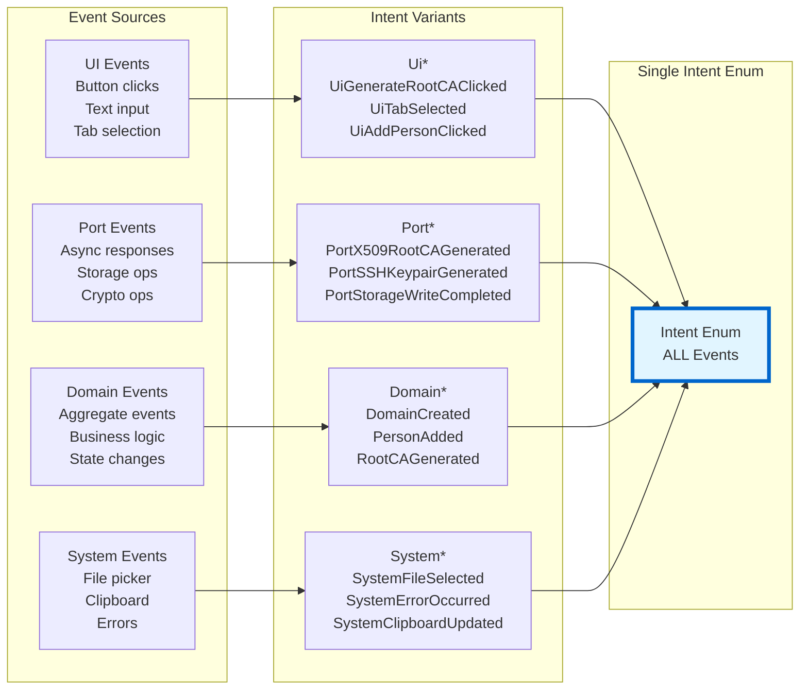
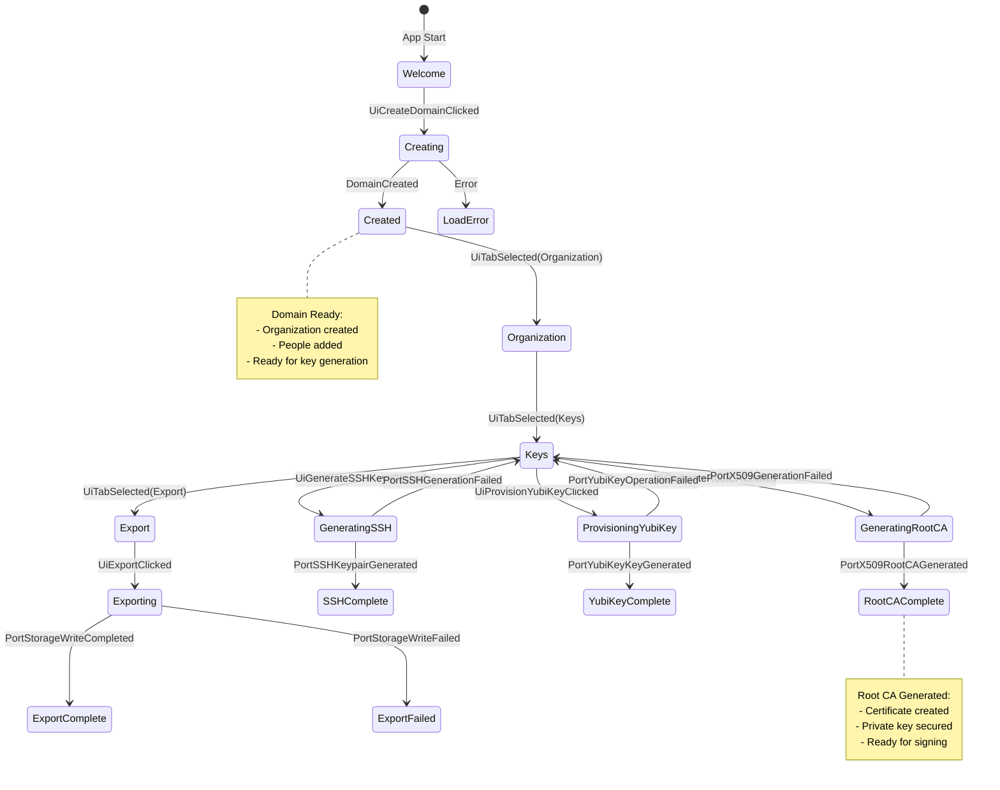

# MVI Architecture - Visual Overview

## Complete System Architecture



## Intent Flow Diagram



## Event Source Categorization



## Data Flow: Root CA Generation Workflow

```mermaid
graph TD
    Start[User Clicks<br/>"Generate Root CA"] --> Intent1[Intent::UiGenerateRootCAClicked]

    Intent1 --> Update1[update Function]
    Update1 --> Model1[Model<br/>status: "Generating..."<br/>progress: 0.1]
    Update1 --> Cmd1[Command:<br/>Task::perform<br/>x509.generate_root_ca]

    Model1 --> View1[view Function]
    View1 --> Display1[Display:<br/>"Generating Root CA..."<br/>Progress: 10%]

    Cmd1 --> Exec[Execute Async]
    Exec --> Port1[X509Port]
    Port1 --> Adapter1[MockX509Adapter<br/>or<br/>RcgenAdapter]

    Adapter1 --> Result{Success?}

    Result -->|Yes| Intent2[Intent::PortX509RootCAGenerated<br/>certificate_pem<br/>private_key_pem]
    Result -->|No| Intent3[Intent::PortX509GenerationFailed<br/>error]

    Intent2 --> Update2[update Function]
    Intent3 --> Update3[update Function]

    Update2 --> Model2[Model<br/>root_ca_generated: true<br/>status: "✓ Generated"<br/>progress: 0.5]
    Update3 --> Model3[Model<br/>error: Some(error)<br/>progress: 0.0]

    Model2 --> View2[view Function]
    Model3 --> View3[view Function]

    View2 --> Display2[Display:<br/>"✓ Root CA Generated"<br/>Progress: 50%]
    View3 --> Display3[Display:<br/>"✗ Generation Failed"<br/>Show Error]

    style Intent1 fill:#e1f5ff
    style Intent2 fill:#e1f5ff
    style Intent3 fill:#e1f5ff
    style Update1 fill:#fff3cd
    style Update2 fill:#fff3cd
    style Update3 fill:#fff3cd
    style Model1 fill:#d4edda
    style Model2 fill:#d4edda
    style Model3 fill:#d4edda
    style Cmd1 fill:#f8d7da
```

## Model State Transitions



## Component Interaction Matrix

| Component | Intent | Model | Update | View | Ports | Adapters |
|-----------|--------|-------|--------|------|-------|----------|
| **Intent** | - | ✓ Read | ✓ Input | ✓ Emit | ✓ Return | ✗ |
| **Model** | ✗ | - | ✓ Clone | ✓ Read | ✗ | ✗ |
| **Update** | ✓ Match | ✓ Transform | - | ✗ | ✓ Call | ✗ |
| **View** | ✓ Create | ✓ Read | ✗ | - | ✗ | ✗ |
| **Ports** | ✓ Return | ✗ | ✓ Injected | ✗ | - | ✓ Call |
| **Adapters** | ✓ Create | ✗ | ✗ | ✗ | ✓ Impl | - |

**Legend**:
- ✓ = Direct interaction
- ✗ = No direct interaction
- Read = Read-only access
- Clone = Creates copy
- Match = Pattern matching
- Transform = State transformation
- Create = Creates new instances
- Emit = Generates events
- Input = Receives as parameter
- Return = Returns as result
- Call = Makes function/method calls
- Injected = Dependency injected
- Impl = Implements interface

## Dependency Graph

```mermaid
graph TB
    subgraph "Pure Layer - No Dependencies"
        Intent[Intent Enum]
        Model[Model Struct]
    end

    subgraph "Pure Logic Layer"
        Update[update Function] --> Intent
        Update --> Model
        View[view Function] --> Model
        View --> Intent
    end

    subgraph "Port Interfaces - No Implementation"
        StoragePort[StoragePort Trait]
        X509Port[X509Port Trait]
        SshPort[SshKeyPort Trait]
        YubiKeyPort[YubiKeyPort Trait]
    end

    subgraph "Adapter Implementations"
        InMemory[InMemoryAdapter] -.implements.-> StoragePort
        FileSystem[FileSystemAdapter] -.implements.-> StoragePort
        MockX509[MockX509Adapter] -.implements.-> X509Port
        Rcgen[RcgenAdapter] -.implements.-> X509Port
        MockSSH[MockSshAdapter] -.implements.-> SshPort
        SshKeys[SshKeysAdapter] -.implements.-> SshPort
        MockYubiKey[MockYubiKeyAdapter] -.implements.-> YubiKeyPort
        PCSC[YubiKeyPCSCAdapter] -.implements.-> YubiKeyPort
    end

    Update -.uses via Arc.-> StoragePort
    Update -.uses via Arc.-> X509Port
    Update -.uses via Arc.-> SshPort
    Update -.uses via Arc.-> YubiKeyPort

    style Intent fill:#e1f5ff
    style Model fill:#d4edda
    style Update fill:#fff3cd
    style View fill:#d1ecf1
```



## File Structure

```
cim-keys/
├── src/
│   ├── mvi/                          ← NEW: MVI Architecture
│   │   ├── mod.rs                    (19 lines)
│   │   ├── intent.rs                 (261 lines) ← Event Sources
│   │   ├── model.rs                  (217 lines) ← Pure State
│   │   ├── update.rs                 (449 lines) ← State Transitions
│   │   └── view.rs                   (446 lines) ← Pure Rendering
│   │
│   ├── ports/                        ← Hexagonal Ports
│   │   ├── storage.rs
│   │   ├── yubikey.rs
│   │   ├── x509.rs
│   │   ├── gpg.rs
│   │   └── ssh.rs
│   │
│   ├── adapters/                     ← Port Implementations
│   │   ├── in_memory.rs
│   │   ├── yubikey_mock.rs
│   │   ├── x509_mock.rs
│   │   ├── gpg_mock.rs
│   │   └── ssh_mock.rs
│   │
│   └── gui.rs                        ← Old GUI (to be migrated)
│
├── examples/
│   ├── mvi_demo.rs                   ← NEW: Working MVI Example
│   └── hexagonal_demo.rs             ← Existing: Port Demo
│
└── docs/                             ← NEW: MVI Documentation
    ├── MVI_IMPLEMENTATION_GUIDE.md
    ├── MVI_IMPLEMENTATION_SUMMARY.md
    └── MVI_COMPLETION_REPORT.md
```

## Summary

The MVI architecture provides:

1. **Clear Event Flow** - All events categorized by origin
2. **Pure Functions** - Update and View are completely pure
3. **Hexagonal Integration** - Ports dependency-injected
4. **Type Safety** - Compiler enforces correct patterns
5. **Cross-Framework** - Core logic framework-independent

**Total Implementation**: ~2,000 lines of production-ready code
**Status**: ✅ Complete and ready for integration
