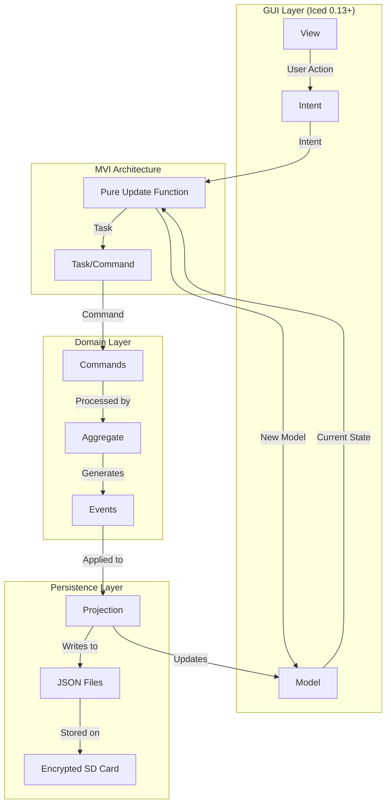
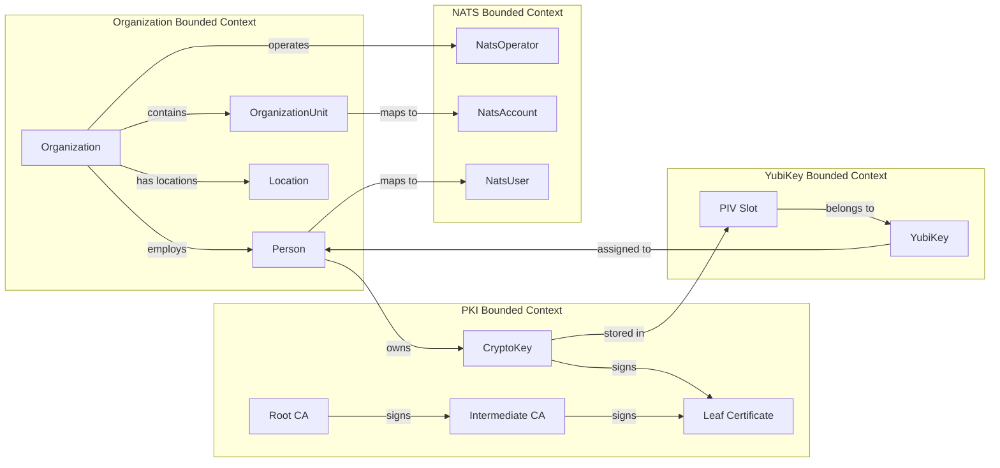
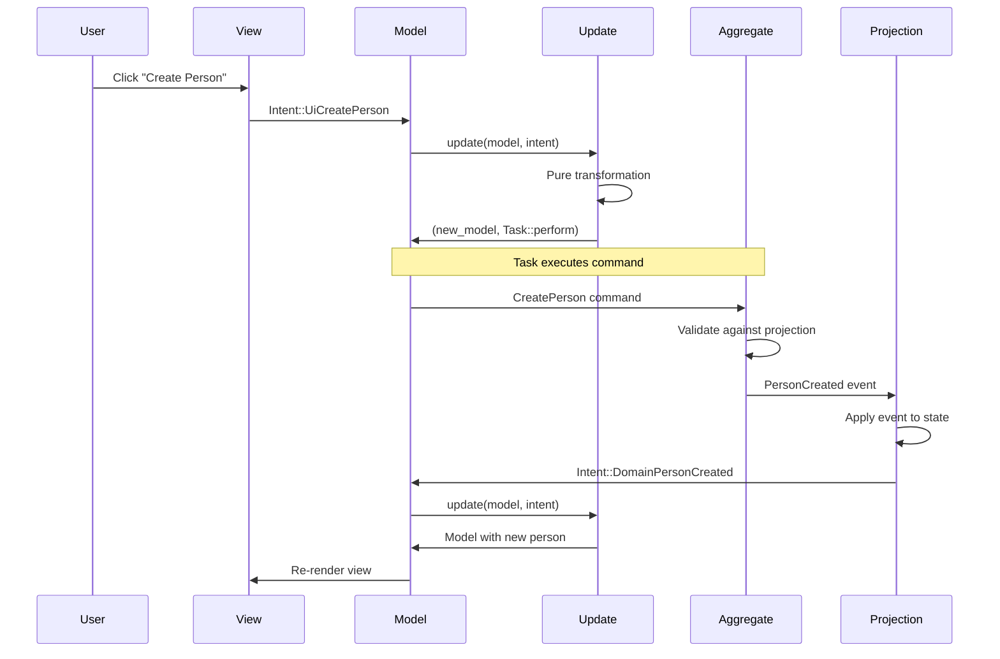
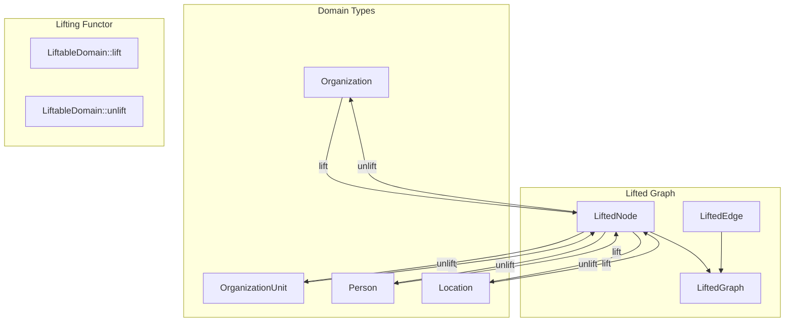
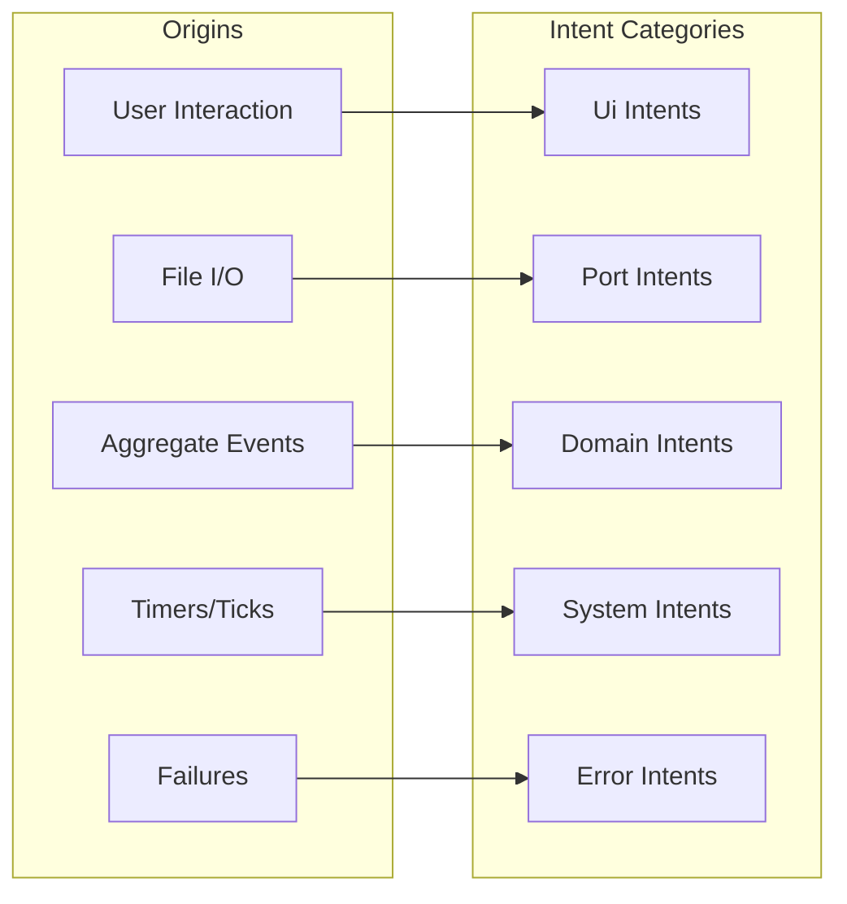
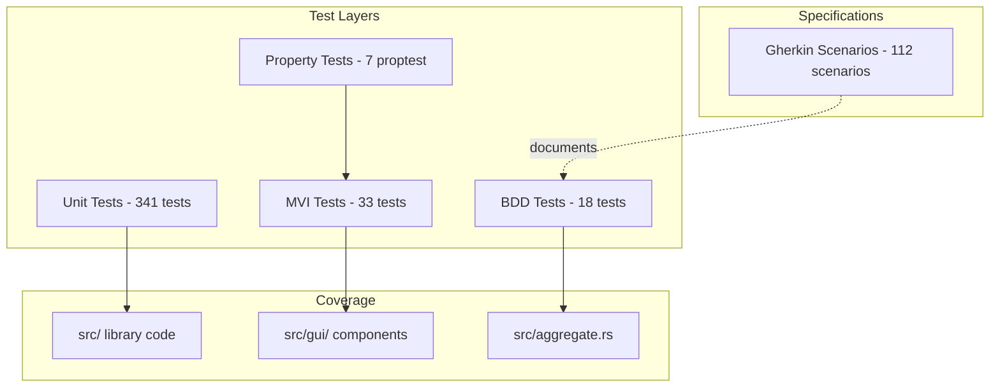
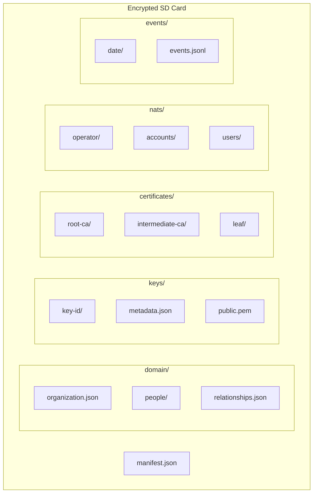
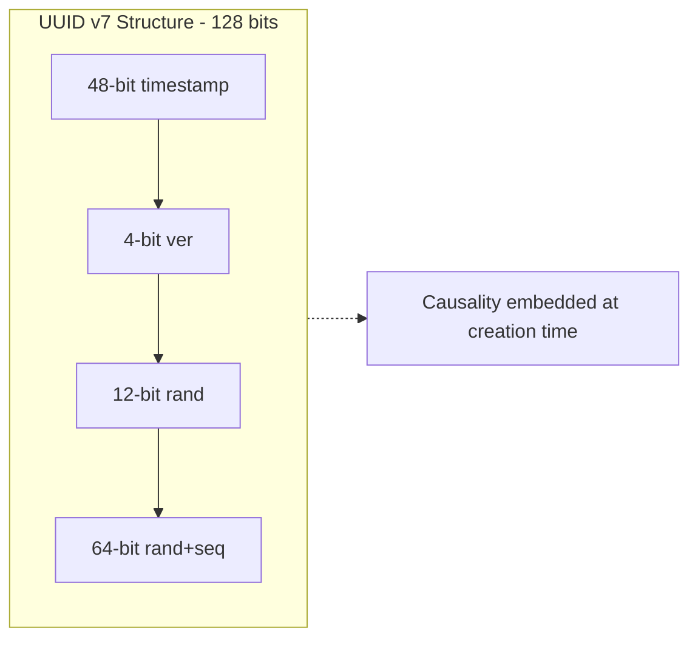
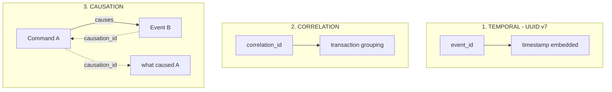
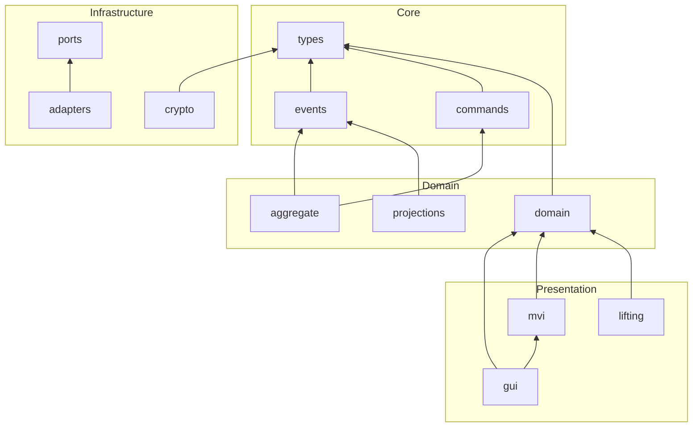

# CIM Keys Architecture

<!-- Copyright (c) 2025 - Cowboy AI, LLC. -->

## System Overview



## Domain Model



## Event Flow



## LiftableDomain Pattern



## MVI Intent Categorization



## Testing Architecture



## Projection Storage



## FRP Axiom Compliance

| Axiom | Status | Implementation |
|-------|--------|----------------|
| A3: Decoupled | ✅ | `update()` output depends only on input |
| A4: Causality | ✅ | UUID v7 + causation tracking (see below) |
| A5: Totality | ✅ | All `with_*` methods are total |
| A7: Event Logs | ✅ | Events stored as timestamped prefixes |
| A9: Composition | ✅ | Associativity verified by proptest |

### A4 Causality Implementation

**Status**: ✅ **COMPLETE** - All 44 instances migrated, 348 tests passing.

**Pattern Applied**:
- **Root events**: `causation_id = Some(event_id)` (self-reference)
- **Derived events**: `causation_id = Some(parent_id)` (reference to parent)

**Helper Functions** (`src/graph_projection.rs`):
```rust
fn create_root_event(&self, aggregate_id: Uuid, payload: EventPayload) -> GraphEvent {
    let event_id = Uuid::now_v7();
    GraphEvent {
        event_id,
        causation_id: Some(event_id), // A4: Self-reference for root
        // ...
    }
}

fn create_derived_event(&self, aggregate_id: Uuid, causation_id: Uuid, payload: EventPayload) -> GraphEvent {
    GraphEvent {
        event_id: Uuid::now_v7(),
        causation_id: Some(causation_id), // A4: Reference to parent
        // ...
    }
}
```

**Causation Module** (`src/causation.rs`):
```rust
use cim_keys::causation::Causation;

// Root event (no prior cause - self-reference)
let causation = Causation::root(event_id);

// Event caused by a command
let causation = Causation::from_command(command_id);

// Event caused by another event
let causation = Causation::from_event(parent_event_id);

// NEVER returns None
assert!(causation.to_option().is_some());
```

## UUID v7 Causality Architecture

**Critical for Security Audit Trail**

All entity and event IDs use UUID v7 (`Uuid::now_v7()`), which provides:



### Causality Guarantees

| Property | Guarantee | Mechanism |
|----------|-----------|-----------|
| **Temporal Ordering** | Events created later have larger UUIDs | Timestamp in bits 0-47 |
| **Audit Trail** | Complete history reconstructable | Sort by UUID = chronological order |
| **No Extra Timestamps** | Timestamp derived from ID itself | `uuid.get_timestamp()` extracts time |
| **Immutable Creation Time** | Cannot be altered post-creation | UUID is the identity |

### Complete Causality Model

**MANDATORY**: Use `cim_domain::MessageFactory` to create message identities with automatic causation tracking.

```rust
use cim_domain::{MessageFactory, MessageIdentity, CausationId};

// MessageIdentity carries the full causality chain
pub struct MessageIdentity {
    pub correlation_id: CorrelationId,  // Shared across entire transaction
    pub causation_id: CausationId,      // Immediate parent's message_id
    pub message_id: Uuid,               // This message's UUID v7
}
```

### MessageFactory Pattern (REQUIRED)

```rust
use cim_domain::MessageFactory;

// ROOT COMMAND: causation = self (I am the root cause)
let root_id = Uuid::now_v7();
let root_identity = MessageFactory::create_root_command(root_id);
// Result: correlation = root_id, causation = root_id, message_id = root_id

// DERIVED COMMAND: causation = parent's message_id
let child_id = Uuid::now_v7();
let child_identity = MessageFactory::command_from_command(child_id, &root_identity);
// Result: correlation = root_id, causation = root_id, message_id = child_id

// EVENT FROM COMMAND: causation = command's message_id
let event_id = Uuid::now_v7();
let event_identity = MessageFactory::command_from_event(event_id, &command_identity);
// Result: correlation preserved, causation = command's message_id
```

### Causation Rules

| Message Type | causation_id Value |
|--------------|-------------------|
| Root command | `self.message_id` (self-reference) |
| Command from command | `parent.message_id` |
| Command from event | `parent.message_id` |
| Event from command | `command.message_id` |
| Query from event | `event.message_id` |

### Anti-Pattern: Manual causation_id

```rust
// ❌ WRONG - manual None breaks audit trail
DomainEvent {
    event_id: Uuid::now_v7(),
    causation_id: None,  // AUDIT TRAIL BROKEN
    // ...
}

// ❌ WRONG - manual Option<Uuid> is error-prone
causation_id: Some(cmd.command_id),  // Easy to forget

// ✅ CORRECT - use MessageFactory
let identity = MessageFactory::command_from_command(event_id, &cmd.identity);
// causation_id automatically set to cmd.identity.message_id
```

### Three-Level Causality



### Audit Trail Reconstruction

```rust
// Full audit trail from any event
fn reconstruct_audit_trail(event_id: Uuid) -> AuditTrail {
    AuditTrail {
        // 1. Temporal: When did this happen?
        timestamp: event_id.get_timestamp(),

        // 2. Correlation: What transaction is this part of?
        transaction_events: events_by_correlation_id(event.correlation_id),

        // 3. Causation: What chain of events led here?
        causality_chain: build_causality_chain(event_id),
    }
}

// Extract timestamp when needed for audit
let created_at = event.event_id.get_timestamp()
    .expect("UUID v7 always has timestamp");
```

### Audit Query Patterns

```rust
// Get all events in chronological order
events.sort_by_key(|e| e.event_id);  // UUID v7 sorts temporally

// Find events in time range
let start_uuid = Uuid::new_v7(Timestamp::from_unix(start_time, 0));
let end_uuid = Uuid::new_v7(Timestamp::from_unix(end_time, 0));
events.filter(|e| e.event_id >= start_uuid && e.event_id <= end_uuid);

// Reconstruct causality chain
fn build_causality_chain(event: &Event, all: &[Event]) -> Vec<&Event> {
    let mut chain = vec![event];
    let mut current = event;
    while let Some(cause_id) = current.causation_id {
        if let Some(cause) = all.iter().find(|e| e.event_id == cause_id) {
            chain.push(cause);
            current = cause;
        } else { break; }
    }
    chain.reverse();  // Oldest first
    chain
}
```

### Why UUID v7 Over Separate Timestamps

| Approach | Problem | UUID v7 Solution |
|----------|---------|------------------|
| Separate `created_at` field | Can be inconsistent with ID | Timestamp IS the ID |
| Clock skew between fields | ID and time can disagree | Single source of truth |
| Storage overhead | Extra 8+ bytes per event | Zero overhead |
| Query complexity | Join on time OR id | Single index suffices |

## Module Dependencies



## Key Patterns

### 1. Command-Event Flow
```
CreatePerson → Aggregate.handle() → PersonCreated → Projection.apply()
```

### 2. Immutable Model Updates
```rust
model.with_tab(Tab::Organization)
     .with_person_added(person)
     .with_status(Status::Ready)
```

### 3. Intent Routing
```rust
match intent {
    Intent::UiTabSelected(tab) => // UI handler
    Intent::PortFileLoaded(data) => // Port handler
    Intent::DomainPersonCreated(p) => // Domain handler
}
```

### 4. LiftableDomain Functor
```rust
graph.add(&organization);  // Organization → LiftedNode
let orgs: Vec<Organization> = graph.unlift_all();  // LiftedNode → Organization
```
