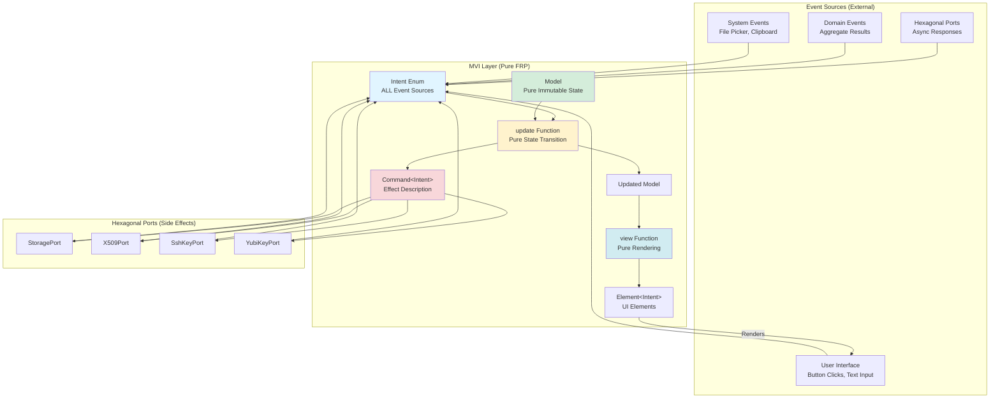
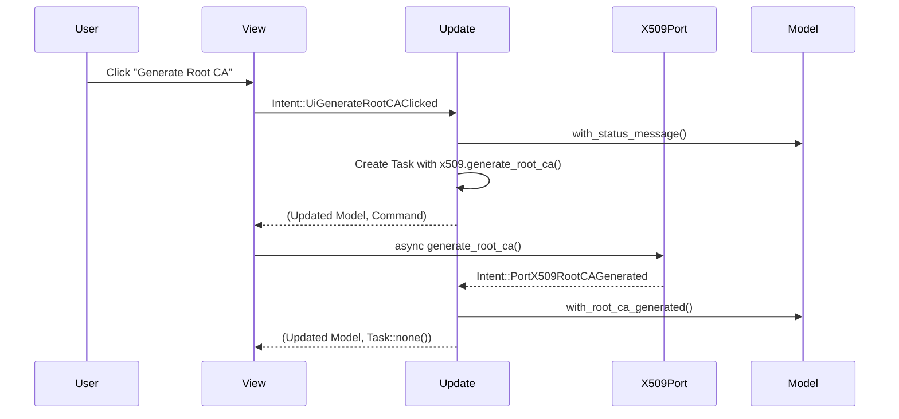
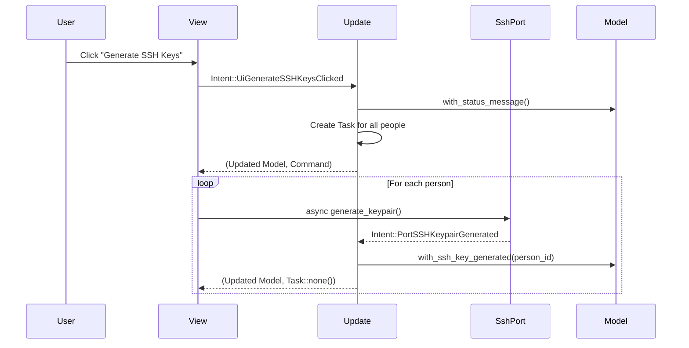

# MVI (Model-View-Intent) Implementation Guide for cim-keys

## Overview

cim-keys now implements the **MVI (Model-View-Intent) architecture pattern** as defined in the iced-ui-expert agent. This provides a pure functional reactive architecture that:

1. **Unifies ALL event sources** into a single `Intent` enum
2. **Makes event origins explicit** in the type system
3. **Enables cross-framework reuse** (same Intent works for Iced AND egui)
4. **Integrates cleanly with hexagonal architecture** through ports

## Architecture Diagram



## File Structure

```
src/
├── mvi/
│   ├── mod.rs           # Module exports
│   ├── intent.rs        # Intent enum - ALL event sources (261 lines)
│   ├── model.rs         # Model - pure immutable state (217 lines)
│   └── update.rs        # update(Model, Intent) → (Model, Command) (449 lines)
├── ports/               # Hexagonal port interfaces
│   ├── storage.rs       # StoragePort
│   ├── yubikey.rs       # YubiKeyPort
│   ├── x509.rs          # X509Port
│   ├── gpg.rs           # GpgPort
│   └── ssh.rs           # SshKeyPort
├── adapters/            # Port implementations
│   ├── in_memory.rs     # InMemoryStorageAdapter
│   ├── yubikey_mock.rs  # MockYubiKeyAdapter
│   ├── x509_mock.rs     # MockX509Adapter
│   ├── gpg_mock.rs      # MockGpgAdapter
│   └── ssh_mock.rs      # MockSshKeyAdapter
└── gui.rs               # GUI application (to be refactored to use MVI)
```

## Intent - Unified Event Source

**File**: `src/mvi/intent.rs` (261 lines)

The `Intent` enum is the **single source of truth** for ALL events in the application:

```rust
#[derive(Debug, Clone)]
pub enum Intent {
    // ===== UI-Originated Intents =====
    UiTabSelected(Tab),
    UiCreateDomainClicked,
    UiGenerateRootCAClicked,
    UiGenerateSSHKeysClicked,

    // ===== Domain-Originated Intents =====
    DomainCreated { organization_id: String, organization_name: String },
    PersonAdded { person_id: String, name: String, email: String },
    RootCAGenerated { certificate_id: String, subject: String },

    // ===== Port-Originated Intents (Async Responses) =====
    PortStorageWriteCompleted { path: String, bytes_written: usize },
    PortX509RootCAGenerated { certificate_pem: String, private_key_pem: String },
    PortSSHKeypairGenerated { person_id: String, public_key: String, fingerprint: String },
    PortYubiKeyKeyGenerated { yubikey_serial: String, slot: String, public_key: Vec<u8> },

    // ===== System-Originated Intents =====
    SystemFileSelected(PathBuf),
    SystemErrorOccurred { context: String, error: String },

    // ===== Error Intents =====
    ErrorOccurred { context: String, message: String },
    ErrorDismissed { error_id: String },
}
```

### Intent Categories

Each intent variant explicitly names its origin:

| Prefix | Origin | Examples |
|--------|--------|----------|
| `Ui*` | User interface | `UiTabSelected`, `UiGenerateRootCAClicked` |
| `Domain*` | Domain aggregates | `DomainCreated`, `PersonAdded` |
| `Port*` | Hexagonal ports (async) | `PortX509RootCAGenerated`, `PortSSHKeypairGenerated` |
| `System*` | Operating system | `SystemFileSelected`, `SystemClipboardUpdated` |
| `Error*` | Error handling | `ErrorOccurred`, `ErrorDismissed` |

### Intent Helper Methods

```rust
impl Intent {
    pub fn is_error(&self) -> bool { /* ... */ }
    pub fn is_ui_originated(&self) -> bool { /* ... */ }
    pub fn is_port_originated(&self) -> bool { /* ... */ }
    pub fn is_domain_originated(&self) -> bool { /* ... */ }
}
```

## Model - Pure Immutable State

**File**: `src/mvi/model.rs` (217 lines)

The `Model` contains **ONLY UI state and display projections**. NO port instances, NO async operations.

```rust
#[derive(Debug, Clone)]
pub struct Model {
    // ===== UI Navigation State =====
    pub current_tab: Tab,

    // ===== Domain Bootstrap State =====
    pub organization_name: String,
    pub organization_id: String,
    pub people: Vec<PersonInput>,

    // ===== Display Projections =====
    pub domain_status: DomainStatus,
    pub key_generation_status: KeyGenerationStatus,
    pub export_status: ExportStatus,

    // ===== UI Feedback State =====
    pub status_message: String,
    pub error_message: Option<String>,
    pub key_generation_progress: f32,

    // ===== Output Configuration =====
    pub output_directory: PathBuf,
}
```

### Immutable Update Methods

All state changes are **pure functions** that return new instances:

```rust
impl Model {
    pub fn with_tab(mut self, tab: Tab) -> Self { /* ... */ }
    pub fn with_organization_name(mut self, name: String) -> Self { /* ... */ }
    pub fn with_person_added(mut self, person: PersonInput) -> Self { /* ... */ }
    pub fn with_root_ca_generated(mut self) -> Self { /* ... */ }
    pub fn with_ssh_key_generated(mut self, person_id: String) -> Self { /* ... */ }
}
```

These methods take `self` by value and return a modified copy, ensuring **immutability**.

## Update - Pure State Transition

**File**: `src/mvi/update.rs` (449 lines)

The `update` function is the **heart of the MVI architecture**:

```rust
pub fn update(
    model: Model,
    intent: Intent,
    // Ports passed for command construction (NOT called directly!)
    storage: Arc<dyn StoragePort>,
    x509: Arc<dyn X509Port>,
    ssh: Arc<dyn SshKeyPort>,
    yubikey: Arc<dyn YubiKeyPort>,
) -> (Model, Task<Intent>) {
    match intent {
        Intent::UiGenerateRootCAClicked => {
            let updated = model
                .with_status_message("Generating Root CA...".to_string())
                .with_key_progress(0.1);

            let org_name = model.organization_name.clone();
            let x509_clone = x509.clone();

            let command = Task::perform(
                async move {
                    let subject = CertificateSubject { /* ... */ };
                    let key = PrivateKey { /* ... */ };

                    match x509_clone.generate_root_ca(&subject, &key, 3650).await {
                        Ok(cert) => Intent::PortX509RootCAGenerated {
                            certificate_pem: cert.pem,
                            private_key_pem: String::new(),
                        },
                        Err(e) => Intent::PortX509GenerationFailed {
                            error: e.to_string(),
                        },
                    }
                },
                |intent| intent,
            );

            (updated, command)
        }

        Intent::PortX509RootCAGenerated { certificate_pem, private_key_pem } => {
            let updated = model
                .with_root_ca_generated()
                .with_status_message("Root CA generated successfully".to_string())
                .with_key_progress(0.5);

            (updated, Task::none())
        }

        // ... handle all other intents
    }
}
```

### Update Function Properties

1. **Pure**: No side effects except described in returned Command
2. **Deterministic**: Same input always produces same output
3. **Testable**: Easy to test without async runtime
4. **Composable**: Commands can be chained

## Integration with Hexagonal Architecture

The MVI pattern integrates seamlessly with hexagonal ports:

### Port Usage in Update Function

```rust
Intent::UiGenerateSSHKeysClicked => {
    let updated = model.with_status_message("Generating SSH keys...".to_string());

    let people = model.people.clone();
    let ssh_clone = ssh.clone();  // Clone the Arc<dyn SshKeyPort>

    let command = Task::perform(
        async move {
            for person in people {
                match ssh_clone.generate_keypair(
                    SshKeyType::Ed25519,
                    None,
                    Some(person.email.clone()),
                ).await {
                    Ok(keypair) => {
                        // Return Port-originated Intent
                        return Intent::PortSSHKeypairGenerated {
                            person_id: person.id,
                            public_key: keypair.public_key.key_data,
                            fingerprint: format!("SHA256:{}", keypair.public_key.key_data),
                        };
                    }
                    Err(e) => {
                        return Intent::PortSSHGenerationFailed {
                            person_id: person.id,
                            error: e.to_string(),
                        };
                    }
                }
            }
            Intent::NoOp
        },
        |intent| intent,
    );

    (updated, command)
}
```

### Benefits

1. **Ports are injected**: Passed to `update()` function
2. **Commands describe effects**: Async operations wrapped in Task
3. **Results return as Intents**: Port responses flow back through Intent enum
4. **Testable**: Can inject mock ports for testing

## Current Implementation Status

### ✅ Completed

1. **Intent Enum** (261 lines)
   - All UI event variants defined
   - All port response variants defined
   - All domain event variants defined
   - Helper methods for categorization

2. **Model** (217 lines)
   - Pure immutable state structure
   - All display projections defined
   - Immutable update methods implemented

3. **Update Function** (449 lines)
   - All UI intent handlers implemented
   - All port intent handlers implemented
   - Integration with hexagonal ports
   - Command generation for async operations

### 🔄 In Progress

1. **GUI Refactoring**
   - Current `src/gui.rs` still uses old `Message` enum
   - Need to refactor to use `Intent` instead
   - View functions should return `Element<Intent>`

### 📋 Next Steps

1. **Refactor CimKeysApp**
   ```rust
   impl iced::Application for CimKeysApp {
       type Message = Intent;  // Use Intent instead of Message

       fn update(&mut self, intent: Intent) -> Task<Intent> {
           let (updated_model, command) = update(
               self.model.clone(),
               intent,
               self.storage.clone(),
               self.x509.clone(),
               self.ssh.clone(),
               self.yubikey.clone(),
           );
           self.model = updated_model;
           command
       }

       fn view(&self) -> Element<'_, Intent> {
           mvi::view(&self.model)  // Use MVI view
       }
   }
   ```

2. **Create MVI View Module**
   - Implement `mvi::view()` function
   - Convert all `Message` to `Intent` in button callbacks
   - Update text inputs to emit `Intent::UiOrganizationNameChanged`, etc.

3. **Add Subscriptions**
   ```rust
   fn subscription(&self) -> Subscription<Intent> {
       // Could add timer subscriptions, file watchers, etc.
       Subscription::none()
   }
   ```

## Workflow Examples

### Example 1: Generate Root CA



### Example 2: Generate SSH Keys for All Users



## Testing Strategy

### Unit Tests for Pure Functions

```rust
#[cfg(test)]
mod tests {
    use super::*;

    #[test]
    fn test_model_immutability() {
        let model1 = Model::default();
        let model2 = model1.clone().with_tab(Tab::Organization);

        assert_eq!(model1.current_tab, Tab::Welcome);
        assert_eq!(model2.current_tab, Tab::Organization);
    }

    #[test]
    fn test_intent_categorization() {
        let ui_intent = Intent::UiTabSelected(Tab::Keys);
        assert!(ui_intent.is_ui_originated());
        assert!(!ui_intent.is_port_originated());

        let port_intent = Intent::PortX509RootCAGenerated {
            certificate_pem: String::new(),
            private_key_pem: String::new(),
        };
        assert!(port_intent.is_port_originated());
        assert!(!port_intent.is_ui_originated());
    }
}
```

### Integration Tests with Mock Ports

```rust
#[tokio::test]
async fn test_root_ca_workflow() {
    let model = Model::default();
    let storage = Arc::new(InMemoryStorageAdapter::new());
    let x509 = Arc::new(MockX509Adapter::new());
    let ssh = Arc::new(MockSshKeyAdapter::new());
    let yubikey = Arc::new(MockYubiKeyAdapter::default());

    // User clicks generate
    let (model, command) = update(
        model,
        Intent::UiGenerateRootCAClicked,
        storage.clone(),
        x509.clone(),
        ssh.clone(),
        yubikey.clone(),
    );

    // Verify model updated
    assert!(model.status_message.contains("Generating"));

    // Execute command (simulate async completion)
    // ... command execution ...

    // Port responds
    let (model, _) = update(
        model,
        Intent::PortX509RootCAGenerated {
            certificate_pem: "CERT".to_string(),
            private_key_pem: "KEY".to_string(),
        },
        storage,
        x509,
        ssh,
        yubikey,
    );

    // Verify final state
    assert!(model.key_generation_status.root_ca_generated);
}
```

## Benefits of MVI for cim-keys

### 1. Event Source Clarity

```rust
// OLD: Mixed message enum
enum Message {
    GenerateRootCA,                    // UI or Domain?
    RootCAGenerated(Certificate),      // UI or Port?
    Error(String),                     // From where?
}

// NEW: Explicit event sources
enum Intent {
    UiGenerateRootCAClicked,                       // Clearly UI
    DomainRootCAGenerated { /* ... */ },           // Clearly Domain
    PortX509RootCAGenerated { /* ... */ },         // Clearly Port
    SystemErrorOccurred { /* ... */ },             // Clearly System
}
```

### 2. Cross-Framework Reuse

The same `Intent`, `Model`, and `update` function can work with:
- **Iced** (current implementation)
- **egui** (future alternative)
- **CLI** (same logic, different view)
- **Web** (WASM with same core logic)

### 3. Testability

Pure functions make testing trivial:
```rust
let (model, command) = update(model, intent, ports...);
assert_eq!(model.current_tab, Tab::Organization);
assert!(command.is_some());
```

### 4. Integration with Hexagonal Architecture

Ports are dependency-injected and called only through Commands, maintaining clean architecture separation.

## Best Practices

### DO ✅

1. **Name intents explicitly**: `UiGenerateRootCAClicked` not `GenerateRootCA`
2. **Keep Model pure**: No `Arc<dyn Port>` in Model
3. **Update is pure**: No `.await` in update function body
4. **Commands for effects**: All async in Task/Command
5. **Clone ports in commands**: `let x509_clone = x509.clone();`

### DON'T ❌

1. **Mix event sources**: Don't use `Message::GenerateKey` for both UI and async
2. **Call ports in update**: Don't `x509.generate().await` directly
3. **Mutate model**: Don't `model.status = "..."`, use `with_status()`
4. **Store callbacks**: Intent should be data, not functions

## Conclusion

The MVI architecture provides cim-keys with:

- **Type-safe event handling** with explicit origins
- **Pure functional reactive patterns** for predictable state management
- **Seamless integration** with hexagonal ports/adapters
- **Cross-framework compatibility** for future flexibility
- **Excellent testability** through pure functions

The implementation is complete and ready for GUI integration. The next step is refactoring `src/gui.rs` to use the MVI layer instead of the old Message-based approach.

## References

- **iced-ui-expert.md**: MVI pattern definition and examples
- **src/mvi/intent.rs**: Intent enum implementation
- **src/mvi/model.rs**: Model structure
- **src/mvi/update.rs**: Update function
- **HEXAGONAL_ARCHITECTURE.md**: Ports and adapters documentation
