# Single Passphrase → Complete PKI Workflow

## Goal

**Enable a single person with a single passphrase to bootstrap an entire PKI for their small business CIM infrastructure.**

From one passphrase, generate:
- ✅ Root CA (stored on air-gapped YubiKey)
- ✅ Intermediate CAs (per organizational unit)
- ✅ User certificates (SSH, GPG, X.509)
- ✅ NATS credentials (Operator, Accounts, Users)
- ✅ Encrypted storage on SD card

All **offline, air-gapped, and cryptographically secure**.

## The Workflow

```mermaid
graph TB
    Start[👤 User with Passphrase] --> Step1[1️⃣ Generate Master Seed]

    Step1 --> Step2[2️⃣ Create Organization]
    Step2 --> Step3[3️⃣ Add People]

    Step3 --> Step4[4️⃣ Generate Root CA]
    Step4 --> YubiKey1[Store Root CA<br/>on YubiKey 1]

    YubiKey1 --> Step5[5️⃣ Generate Intermediate CAs]
    Step5 --> YubiKey2[Store Intermediate CAs<br/>on YubiKeys 2-N]

    YubiKey2 --> Step6[6️⃣ Generate User Certificates]
    Step6 --> SSH[SSH Keys]
    Step6 --> GPG[GPG Keys]
    Step6 --> X509[X.509 Certs]

    SSH --> Step7[7️⃣ Generate NATS Credentials]
    GPG --> Step7
    X509 --> Step7

    Step7 --> Operator[NATS Operator]
    Step7 --> Accounts[NATS Accounts]
    Step7 --> Users[NATS Users]

    Operator --> Step8[8️⃣ Export to SD Card]
    Accounts --> Step8
    Users --> Step8

    Step8 --> Encrypted[🔒 Encrypted SD Card<br/>Ready for CIM Deployment]

    style Start fill:#e1f5ff
    style Encrypted fill:#d4edda
```



## Detailed Step-by-Step

### Step 1: Master Seed from Passphrase

**User Input**: Single passphrase (e.g., "correct horse battery staple mountain river sunset")

**Process**:
```rust
// Derive master seed using Argon2id (memory-hard KDF)
let salt = b"cim-keys-v1-organization-xyz";  // Unique per organization
let master_seed = argon2id::derive(
    passphrase,
    salt,
    iterations: 10,
    memory: 1_048_576,  // 1 GB memory
    parallelism: 4,
);

// Create deterministic key hierarchy
let root_ca_seed = HKDF::derive(master_seed, "root-ca");
let intermediate_seeds = (0..num_units).map(|i|
    HKDF::derive(master_seed, format!("intermediate-ca-{}", i))
);
let user_seeds = people.map(|person|
    HKDF::derive(master_seed, format!("user-{}", person.id))
);
```

**Output**: Deterministic seed hierarchy from single passphrase

### Step 2: Create Organization

**UI Flow**:
```
Welcome Screen
  └─→ "Create New Domain" button
      └─→ Organization Setup Screen
          ├─ Organization Name: [________________]
          ├─ Organization ID:   [________________]
          └─ [Next] button → Intent::UiCreateDomainClicked
```

**MVI Intent Flow**:
```rust
Intent::UiCreateDomainClicked {
    organization_name,
    organization_id,
    master_passphrase_hash,  // Hashed, never stored in plaintext
}
  ↓
DomainAggregate::create_organization()
  ↓
DomainCreatedEvent {
    organization_id,
    created_at: Uuid::now_v7(),  // Time-ordered UUID
}
  ↓
Intent::DomainCreated { organization_id, organization_name }
  ↓
Model.with_domain_status(DomainStatus::Created { ... })
```

### Step 3: Add People

**UI Flow**:
```
Organization Screen
  ├─ People List:
  │   ├─ [Name] [Email] [Role] [Remove]
  │   ├─ [Name] [Email] [Role] [Remove]
  │   └─ ...
  └─ [+ Add Person] → Intent::UiAddPersonClicked
```

**MVI Intent Flow**:
```rust
Intent::UiAddPersonClicked
  ↓
Model.with_person_added(PersonInput {
    id: Uuid::now_v7(),
    name: String::new(),
    email: String::new(),
})
  ↓
Intent::UiPersonNameChanged { index, name }
Intent::UiPersonEmailChanged { index, email }
  ↓
PersonAddedEvent {
    person_id,
    name,
    email,
    organization_id,
}
```

**Example People**:
- Alice (CEO, Root Authority)
- Bob (CTO, Infrastructure Admin)
- Carol (Developer, User)
- Dave (Developer, User)

### Step 4: Generate Root CA

**UI Flow**:
```
Keys Screen
  └─→ "Generate Root CA" button
      └─→ Intent::UiGenerateRootCAClicked
          ├─ Derive root CA keys from master seed
          ├─ Generate self-signed root certificate
          ├─ Prompt to insert YubiKey #1
          └─ Store root CA private key on YubiKey PIV slot 9C
```

**Process**:
```rust
// Derive root CA key from master seed
let root_ca_seed = HKDF::derive(master_seed, "root-ca");
let root_ca_keypair = Ed25519::from_seed(root_ca_seed);

// Generate root certificate
let root_cert = X509Certificate {
    subject: "CN=My Business Root CA, O=My Business, C=US",
    issuer: "CN=My Business Root CA, O=My Business, C=US",  // Self-signed
    public_key: root_ca_keypair.public,
    valid_from: now(),
    valid_until: now() + 10 years,
    is_ca: true,
    key_usage: [keyCertSign, cRLSign],
};

// Sign with root private key
let signed_root_cert = root_cert.sign(root_ca_keypair.private);

// Store private key on YubiKey (never touches disk!)
yubikey.store_private_key(
    slot: PIVSlot::DigitalSignature,  // 9C
    key: root_ca_keypair.private,
    pin: derive_yubikey_pin(master_seed, "root-yubikey"),
);
```

**YubiKey Storage**:
- **YubiKey #1 (Root Authority)**:
  - Slot 9C: Root CA private key
  - Requires PIN derived from master seed
  - Physical device = ultimate security

**Output**:
- Root CA certificate (public, exported)
- Root CA private key (on YubiKey, never exported)

### Step 5: Generate Intermediate CAs

**UI Flow**:
```
Keys Screen
  └─→ "Generate Intermediate CAs" button
      └─→ For each Organizational Unit:
          ├─ Derive intermediate CA keys from master seed
          ├─ Generate CSR (Certificate Signing Request)
          ├─ Sign CSR with Root CA (via YubiKey #1)
          ├─ Prompt to insert YubiKey #2, #3, etc.
          └─ Store intermediate CA keys on respective YubiKeys
```

**Process** (for each OU):
```rust
// Derive intermediate CA key from master seed
let intermediate_seed = HKDF::derive(master_seed, format!("intermediate-ca-{}", ou_id));
let intermediate_keypair = Ed25519::from_seed(intermediate_seed);

// Generate CSR
let csr = CertificateSigningRequest {
    subject: format!("CN={} Intermediate CA, O=My Business, C=US", ou_name),
    public_key: intermediate_keypair.public,
};

// Sign with Root CA (requires YubiKey #1)
let intermediate_cert = yubikey1.sign_csr(
    csr,
    root_ca_cert,
    slot: PIVSlot::DigitalSignature,  // Root CA key
    pin: root_yubikey_pin,
);

// Store intermediate key on OU-specific YubiKey
yubikey_ou.store_private_key(
    slot: PIVSlot::DigitalSignature,
    key: intermediate_keypair.private,
    pin: derive_yubikey_pin(master_seed, format!("ou-{}-yubikey", ou_id)),
);
```

**YubiKey Storage**:
- **YubiKey #2 (Engineering Dept)**:
  - Slot 9C: Engineering Intermediate CA
- **YubiKey #3 (Sales Dept)**:
  - Slot 9C: Sales Intermediate CA
- etc.

### Step 6: Generate User Certificates

**UI Flow**:
```
Keys Screen
  └─→ "Generate All User Keys" button
      └─→ For each person:
          ├─ Derive user keys from master seed
          ├─ Generate SSH keypair
          ├─ Generate GPG keypair
          ├─ Generate X.509 certificate (signed by Intermediate CA)
          └─ Optionally provision user YubiKey
```

**SSH Keys** (for each person):
```rust
let user_seed = HKDF::derive(master_seed, format!("user-{}-ssh", person.id));
let ssh_keypair = Ed25519::from_seed(user_seed);

let ssh_public_key = format!(
    "ssh-ed25519 {} {}@mybusiness.com",
    base64::encode(ssh_keypair.public),
    person.name.to_lowercase(),
);

// Store in projection
ssh_keys_projection.add(
    person_id: person.id,
    public_key: ssh_public_key,
    private_key: ssh_keypair.private,  // Encrypted with passphrase
);
```

**GPG Keys** (for each person):
```rust
let gpg_seed = HKDF::derive(master_seed, format!("user-{}-gpg", person.id));
let gpg_keypair = generate_gpg_keypair(
    seed: gpg_seed,
    user_id: format!("{} <{}@mybusiness.com>", person.name, person.email),
    key_type: RSA4096,  // Or Ed25519 for newer GPG
);

// Export public key
let public_key_armor = gpg_keypair.public.to_armor();

// Encrypt private key with passphrase
let encrypted_private = gpg_keypair.private.encrypt(passphrase);
```

**X.509 Certificates** (for each person):
```rust
// Derive user X.509 key
let x509_seed = HKDF::derive(master_seed, format!("user-{}-x509", person.id));
let x509_keypair = Ed25519::from_seed(x509_seed);

// Generate CSR
let user_csr = CertificateSigningRequest {
    subject: format!("CN={}, O=My Business, C=US", person.name),
    subject_alt_names: [format!("email:{}@mybusiness.com", person.email)],
    public_key: x509_keypair.public,
};

// Sign with Intermediate CA (via OU YubiKey)
let user_cert = ou_yubikey.sign_csr(
    user_csr,
    intermediate_ca_cert,
    slot: PIVSlot::DigitalSignature,
    pin: ou_yubikey_pin,
);
```

### Step 7: Generate NATS Credentials

**NATS Hierarchy**:
```
Operator (Root)
  └─ Account (Per Organizational Unit)
      └─ User (Per Person)
```

**NATS Operator** (derived from master seed):
```rust
let operator_seed = HKDF::derive(master_seed, "nats-operator");
let operator_keypair = NKey::from_seed(operator_seed);

let operator_jwt = create_operator_jwt(
    issuer: operator_keypair.public_key(),
    signing_keys: [operator_keypair.public_key()],
    operator_service_urls: ["nats://nats.mybusiness.internal:4222"],
);

// Sign JWT with operator key
let signed_operator_jwt = operator_jwt.sign(operator_keypair);
```

**NATS Accounts** (one per OU):
```rust
let account_seed = HKDF::derive(master_seed, format!("nats-account-{}", ou_id));
let account_keypair = NKey::from_seed(account_seed);

let account_jwt = create_account_jwt(
    issuer: operator_keypair.public_key(),
    subject: account_keypair.public_key(),
    name: format!("{} Department", ou_name),
    limits: AccountLimits {
        max_connections: 1000,
        max_subscriptions: 10000,
        max_data: 10_GB,
        max_payload: 1_MB,
    },
);

let signed_account_jwt = account_jwt.sign(operator_keypair);
```

**NATS Users** (one per person):
```rust
let user_seed = HKDF::derive(master_seed, format!("nats-user-{}", person.id));
let user_keypair = NKey::from_seed(user_seed);

let user_jwt = create_user_jwt(
    issuer: account_keypair.public_key(),
    subject: user_keypair.public_key(),
    name: person.name,
    permissions: UserPermissions {
        publish: ["employees.>"],
        subscribe: ["employees.>", format!("user.{}.>", person.id)],
    },
);

let signed_user_jwt = user_jwt.sign(account_keypair);

// Create user credentials file
let user_creds = format!(
    "-----BEGIN NATS USER JWT-----\n{}\n------END NATS USER JWT------\n\n\
     ************************* IMPORTANT *************************\n\
     NKEY Seed printed below can be used to sign and prove identity.\n\
     NKEYs are sensitive and should be treated as secrets.\n\n\
     -----BEGIN USER NKEY SEED-----\n{}\n------END USER NKEY SEED------\n\n\
     *************************************************************",
    signed_user_jwt,
    user_keypair.seed,
);
```

### Step 8: Export to Encrypted SD Card

**UI Flow**:
```
Export Screen
  └─→ "Export to SD Card" button
      ├─ Insert SD card
      ├─ Create encrypted partition (LUKS)
      ├─ Mount encrypted partition
      ├─ Write all credentials and keys
      └─ Unmount and eject
```

**Export Structure**:
```
/mnt/encrypted-sd/cim-keys-mybusiness/
├── manifest.json                     # Master index
├── organization/
│   ├── organization.json             # Org details
│   ├── people.json                   # All people
│   └── organizational-units.json     # Departments
│
├── pki/
│   ├── root-ca/
│   │   ├── root-ca.crt               # Public certificate
│   │   ├── root-ca.metadata.json     # Metadata (YubiKey location)
│   │   └── README.txt                # "Private key on YubiKey #1"
│   │
│   ├── intermediate-ca/
│   │   ├── engineering-ca.crt
│   │   ├── engineering-ca.metadata.json
│   │   ├── sales-ca.crt
│   │   └── sales-ca.metadata.json
│   │
│   └── users/
│       ├── alice/
│       │   ├── alice-x509.crt
│       │   ├── alice-x509.key.enc    # Encrypted with passphrase
│       │   ├── alice-ssh.pub
│       │   ├── alice-ssh.key.enc
│       │   ├── alice-gpg.pub.asc
│       │   └── alice-gpg.sec.asc.enc
│       ├── bob/
│       └── ...
│
├── nats/
│   ├── operator/
│   │   ├── operator.jwt
│   │   └── operator.nk.enc           # Encrypted seed
│   │
│   ├── accounts/
│   │   ├── engineering.jwt
│   │   ├── engineering.nk.enc
│   │   ├── sales.jwt
│   │   └── sales.nk.enc
│   │
│   └── users/
│       ├── alice.creds               # User credentials (JWT + seed)
│       ├── bob.creds
│       └── ...
│
├── audit/
│   ├── creation-log.json             # All operations logged
│   └── key-derivation-paths.json     # Seed hierarchy (for recovery)
│
└── README.md                          # Instructions for deployment
```

**Encryption**:
```bash
# Create encrypted partition
cryptsetup luksFormat /dev/sdX1 --key-file <(echo -n "$passphrase")

# Mount
cryptsetup luksOpen /dev/sdX1 cim-keys-encrypted --key-file <(echo -n "$passphrase")
mkfs.ext4 /dev/mapper/cim-keys-encrypted
mount /dev/mapper/cim-keys-encrypted /mnt/encrypted-sd

# Write files...

# Unmount
umount /mnt/encrypted-sd
cryptsetup luksClose cim-keys-encrypted
```

## Security Properties

### ✅ Single Point of Control
- One passphrase generates entire PKI hierarchy
- Deterministic key derivation (same passphrase = same keys)
- Can regenerate entire PKI from passphrase alone

### ✅ Air-Gapped Security
- All operations offline
- Private keys never touch network
- Root CA key never touches disk (YubiKey only)

### ✅ Hardware-Backed Security
- Root CA on YubiKey #1 (physical security)
- Intermediate CAs on YubiKeys #2-N (departmental security)
- User keys optionally on YubiKeys (personal security)

### ✅ Encryption at Rest
- All exported keys encrypted with passphrase
- SD card LUKS-encrypted
- No plaintext private keys

### ✅ Auditability
- Every operation logged as event
- Complete audit trail
- Key derivation paths recorded for recovery

## Recovery Scenarios

### Scenario 1: Lost SD Card

**Solution**: Re-run entire workflow with same passphrase
- Same organization ID → Same seeds → Same keys
- Deterministic regeneration

### Scenario 2: Forgotten Passphrase

**Solution**: Use YubiKey backup
- Root CA still on YubiKey #1
- Can generate new intermediate CAs
- Cannot recover user keys (by design)

### Scenario 3: Lost YubiKey

**Solution**: Use SD card backup
- Root CA certificate on SD card
- Can import to new YubiKey
- Or generate new root CA (break chain of trust)

## Deployment to CIM Infrastructure

After SD card export:

1. **Insert SD card into CIM server**
2. **Mount encrypted partition**: `cryptsetup luksOpen`
3. **Import NATS credentials**: Copy to `/etc/nats/`
4. **Configure NATS server**: Use operator JWT
5. **Distribute user credentials**: Each person gets their `.creds` file
6. **Import certificates**: Root CA into trust store
7. **Start CIM services**: NATS cluster ready

**Result**: Fully bootstrapped CIM infrastructure from single passphrase!

## Next Implementation Steps

1. **Implement passphrase-to-seed derivation** (Argon2id)
2. **Add YubiKey integration** to update function
3. **Implement deterministic key generation** from seeds
4. **Create complete export workflow** with encryption
5. **Add recovery workflow** (regenerate from passphrase)
6. **Test complete workflow end-to-end**

---

**Status**: Architecture designed, MVI foundation complete, ready for implementation
**Goal**: One passphrase → Complete PKI → CIM deployment
